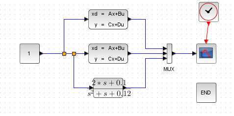
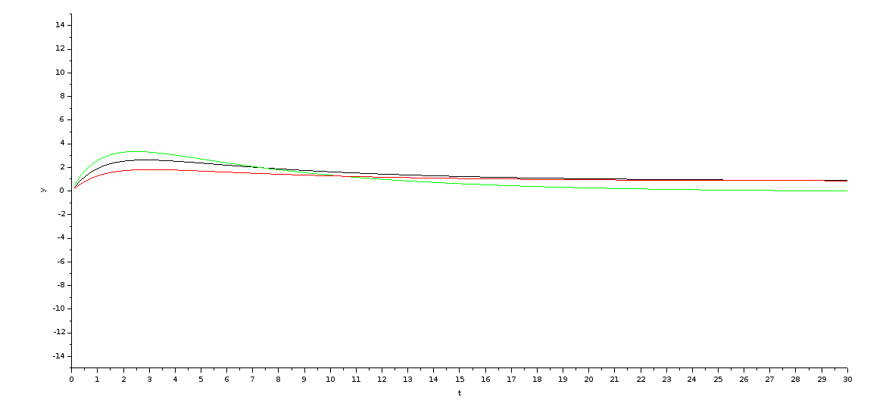
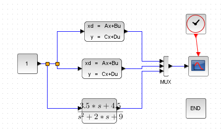
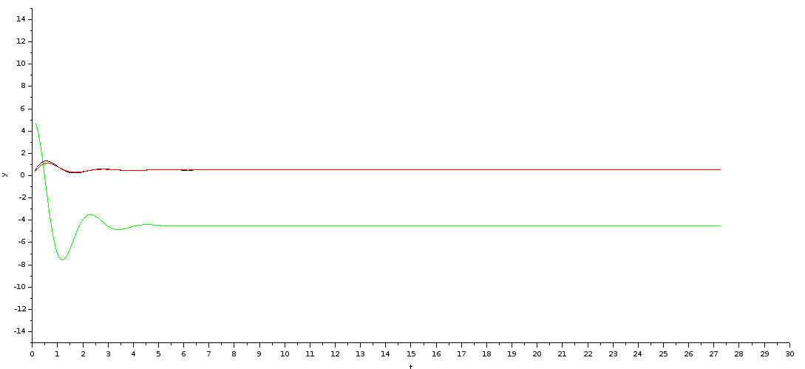
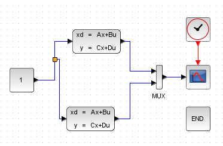
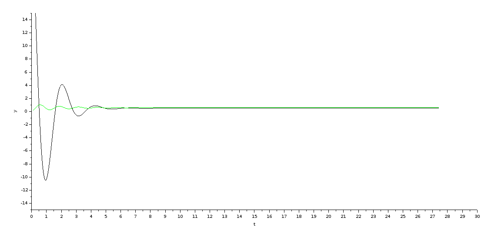

# Цель работы.

# Переход от модели вход-выход к модели вход-состояние-выход

## Исходные данные

$a_0 = 0.12$
$a_1 = 1$
$b_0 = 0.1$
$b_1 = 2$
$b_2 = 0$

$y(0) = 1$
$\dot{y}(0) = 0$

### Уравнение описания системы

$$y^{(2)} + 1y^{(1)} + 0.12y = 0u^{(2)} + 2u^{(1)} + 0.1u$$

$$s^2y + sy + 0.12y = 2su + 0.1u$$

$$y(s^2 + s + 0.12) = u(2s + 0.1)$$

### Передаточная функция

$$W(s) = \frac{2s + 0.1}{s^2 + s + 0.12}$$

### Каноническая управляемая форма

$A =
\begin{pmatrix}
0 & -0.12 \\
1 & -1 \\
\end{pmatrix}$
$B =
\begin{pmatrix}
0.1 \\
2   \\
\end{pmatrix}$
$C =
\begin{pmatrix}
0 \\
1 \\
\end{pmatrix}$

### Каноническая наблюдаемая форма

$A =
\begin{pmatrix}
0     &  1 \\
-0.12 & -1 \\
\end{pmatrix}$
$B =
\begin{pmatrix}
0 \\
1 \\
\end{pmatrix}$
$C =
\begin{pmatrix}
0.1 \\
2 \\
\end{pmatrix}$

# Переход от модели вход-состояние-выход к модели вход-выход

## Исходные данные

$A =
\begin{pmatrix}
-1 &  1 \\
-8 & -1 \\
\end{pmatrix}$
$B =
\begin{pmatrix}
0.5 \\
1 \\
\end{pmatrix}$
$C =
\begin{pmatrix}
5 \\
1 \\
\end{pmatrix}$

## Передаточная функция

$$W(s) = C(sI - A)^{-1} \cdot B$$

$$W(s) =
\begin{pmatrix}
5 & 1 \\
\end{pmatrix}
\cdot \Bigg(s \cdot
\begin{pmatrix}
1 & 0 \\
0 & 1 \\
\end{pmatrix}
-
\begin{pmatrix}
-1 &  1 \\
-8 & -1 \\
\end{pmatrix}
\Bigg)^{-1}
\cdot
\begin{pmatrix}
0.5 \\
1 \\
\end{pmatrix}
= \frac{4.5 + 3.5s}{9 + 2s + s^2}$$

## Модель вход-выход

$$y^{(2)} + 2y^{(1)} + 9 = 3.5u^{(1)} + 4.5$$

## Каноническая управляемая форма

$A =
\begin{pmatrix}
0 & -9 \\
1 & -2 \\
\end{pmatrix}$
$B =
\begin{pmatrix}
4.5 \\
3.5 \\
\end{pmatrix}$
$C =
\begin{pmatrix}
0 & 1 \\
\end{pmatrix}$

## Каноническая наблюдаемая форма

$A =
\begin{pmatrix}
0 & -9 \\
1 & -2 \\
\end{pmatrix}$
$B =
\begin{pmatrix}
0 \\
1 \\
\end{pmatrix}$
$C =
\begin{pmatrix}
4.5 & 3.5 \\
\end{pmatrix}$

# Замена базиса в пространстве состояний

## Исходные данные

$A =
\begin{pmatrix}
-1 &  1 \\
-8 & -1 \\
\end{pmatrix}$
$B =
\begin{pmatrix}
0.5 \\
1 \\
\end{pmatrix}$
$C =
\begin{pmatrix}
5 \\
1 \\
\end{pmatrix}$

$M =
\begin{pmatrix}
5 & 0 \\
5 & 1 \\
\end{pmatrix}$

## Результат преобразования

$A' =
\begin{pmatrix}
0   & 0.2 \\
-45 & -2  \\
\end{pmatrix}$

$B' =
\begin{pmatrix}
0.1 \\
0.5 \\
\end{pmatrix}$

$C' =
\begin{pmatrix}
30 & 1 \\
\end{pmatrix}$

\newpage

# Вывод

В ходе данной лабораторной работы мы ознакомились с методами взаимного перехода
между моделями "вход-выход" и "вход-состояние-выход", а также с каноническими формами
представления моделей "вход-состояние-выход".
