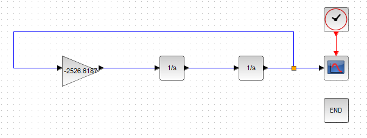
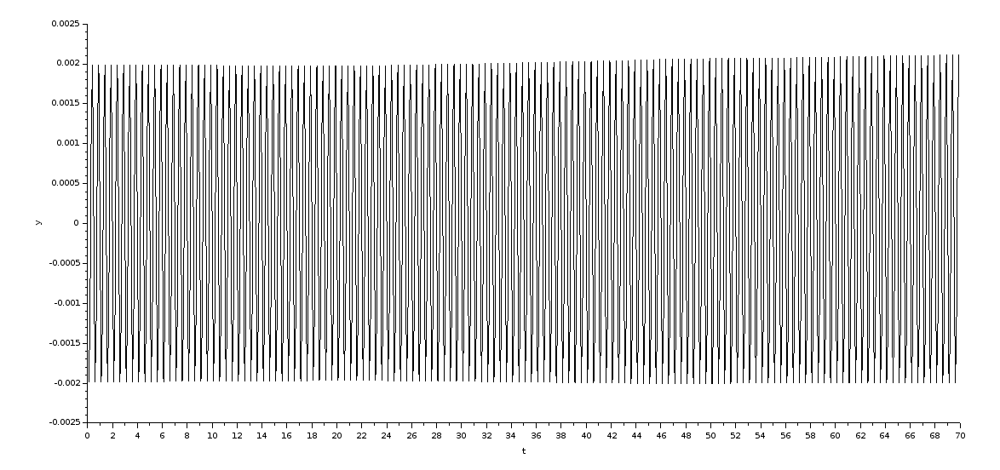
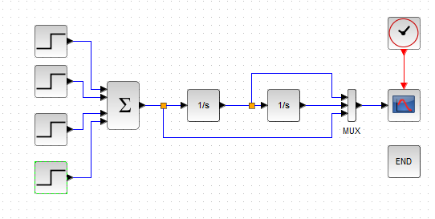
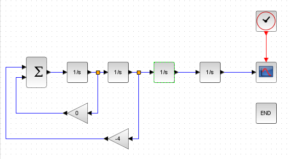
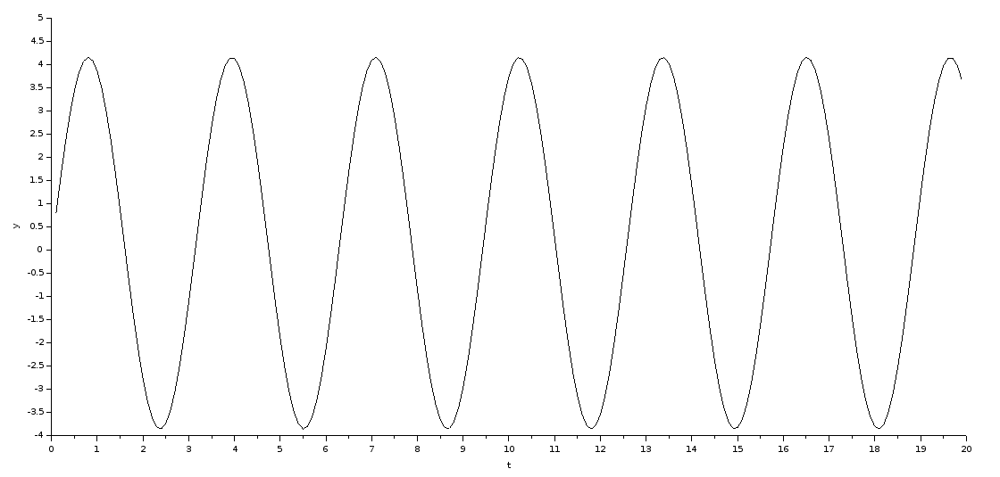

# Цель работы

# Выполнение

## Командный генератор гармонического сигнала

Угол сканирования $\phi$
: 6

Частота сканирования $f$
: 8

Гармоническая функция $g(t) = A\sin (\omega t)$

$$\omega = 2 \pi f \approx 50.26$$

$$A = \dfrac {\tg \phi} {\omega} = 0.002654$$

Таким образом, гармоническая функция обретает следующий вид:

$$g(t) = 0.002654 \sin (50.26t)$$

Матрица коэффициентов:

$$G =
	\begin{bmatrix}
		0         & 1 \\
	   -2526.6187 & 0
	\end{bmatrix}
	H = \begin{bmatrix}
			1 & 0
		\end{bmatrix}
$$

Начальные условия: $z_1(0) = 0, z_2(0) = A \omega = 0.105104$

## Командный генератор с трапецеидальным графиком скорости

Амплитуда скорости $\Delta$
: 4

Амплитуда ускорения $V$
: 2

Конечное значение $F$
: 20

Из исходных данных получаем значения для времён.

- Найдём точку $t_A$ из интегрирования ускорения.

$$v = \int \limits_0^{t_A} \Delta \; \mathrm{d}t = \Delta \cdot t_A \implies  t_A = \dfrac {V} {\delta} = 0.5$$

- Найдем момент времени, когда перемещение равно F в точке $t_C$.

$$P(t_C) = \dfrac {\Delta} {2} t_C^2 + v \cdot t_C - F = 2 t_C^2 + 2 t_C - 20
		\implies t_C = 3.3$$

- Найдём момент времени $t_B$.

$$v = \int \limits_{t_B}^{t_C} \Delta \; \mathrm{d}t
	=  \Delta \cdot (t_C - t_B) \implies t_B
	= \dfrac {\Delta t_C - v} {\Delta} = 2.8
$$

### Матрица коэффициентов

$$G =
	\begin{bmatrix}
		0 & 1 & 0 \\
		0 & 0 & 1 \\
		0 & 0 & 0
	\end{bmatrix}
	H = \begin{bmatrix}
			1 & 0 & 0
		\end{bmatrix}
$$

## Командный генератор возмущения

$$g(t) = 3 e^{-0.5t}\sin t + 0.2 t$$

$$g(t) = 4\sin 2t + 0.3t^2$$

Воспользуемся методом последовательного дифференцирования. Будем дифференцировать до тех
пор, пока очередная функция не окажется линейной комбинацией предыдущих.

$g(t) = z_1$

$g^{(1)}(t) = z_1^{(1)} = z_2 = 0.6 t + 8\cos 2t$

$g^{(2)}(t) = z_2^{(1)} = z_3 = 0.6 - 16\sin 2t$

$g^{(3)}(t) = z_3^{(1)} = z_4 = -32\cos 2t$

$g^{(4)}(t) = z_4^{(1)} = 64 \sin 2t$

$g^{(5)}(t) = 128\cos 2t$

$g^{(5)}(t) = Ag^{(3)} + Bg^{(4)} = -4\cdot(-32\cos 2t) + 0\cdot(64 \sin 2t)
\implies A = -4, B = 0$

### Матрица коэффициентов

$$
	Z = \begin{bmatrix}
		z_1 \\ z_2 \\ z_3 \\ z_4
	\end{bmatrix}
	G =
	\begin{bmatrix}
		0 & 1 & 0 & 0\\
		0 & 0 & 1 & 0 \\
		0 & 0 & 0 & 1 \\
		0 & -4 & 0 & 0
	\end{bmatrix}
	H = \begin{bmatrix}
			1 & 0 & 0
		\end{bmatrix}
$$

### Начальные условия интеграторов

$z_1(0) = 0$
$z_2(0) = 8$
$z_3(0) = 0.6$
$z_4(0) = -32$

\newpage

# Вывод

В ходе выполнения лабораторной работы мы ознакомились
с принципами построения моделей внешних воздействий и с методом
последовательного дифференцирования.
