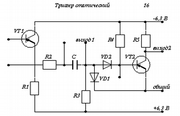

# Задание

-- ------- --------- --------
R1 5 кОм   $\pm$ 20% 0.02 Вт

R2 200 Ом  $\pm$ 10% 0.01 Вт

R3 5.7 кОм $\pm$ 10% 0.003 Вт

R4 15 кОм  $\pm$ 10% 0.01 Вт

R5 2.5 кОм $\pm$ 10% 0.01 Вт

С  450 пФ
-- ------- --------- --------

# Ход работы

## Оптимальное удельное поверхностное сопротивление

$$\rho_{\square\text{опт}} = \sqrt{\dfrac{\sum\limits_{i=1}^n R_i}
{\sum\limits_{i=1}^n R_i^{-1}}}$$

$$\rho_{\square\text{опт}} = \sqrt{\dfrac{5000 + 200 + 5700 + 15000 + 2500}
{\frac 1 {5000} + \frac 1 {200} + \frac 1 {5700} + \frac 1 {15000} +
\frac 1 {2500}}} \approx 2205 \approx 2200
\left(\dfrac{\text{Ом}}{\square}\right)$$

## Выбор материала резистивной пленки

Наименование  $\rho_{\square}, \frac{\text{Ом}}{\square}$ Сопротивление, Ом $W_0 \frac{\text{Вт}}{\text{см}^2}$
------------- ------------------------------------------- ----------------- --------------------------------------
Сплав РС-3001 800-3000                                    50-30000          2
------------- ------------------------------------------- ----------------- --------------------------------------

## Определение коэффициента формы

$$k_{\text{ф}i} = \dfrac{R_i}{\rho_\square}$$

$R_i$ $R_i / \rho_\square$ $k_{\text{ф}i}$
----- -------------------- --------------- ---------
$R_1$ $5000 / 2200$        $2.3$           $l >   b$
$R_2$ $200 / 2200$         $0.1$           $l <   b$
$R_3$ $5700 / 2200$        $2.6$           $l >   b$
$R_4$ $15000 / 2200$       $6.8$           $l >   b$
$R_5$ $2500 / 2200$        $1.1$           $l >   b$
----- -------------------- --------------- ---------

## Определение ширины резисторов

$$b \ge \max [b_\text{точн}, b_W]$$

$$b_\text{точн} = \left\{
\begin{aligned}
0.2 \text{ мм},\;&\Delta R = \pm 20\%,\\
0.3 \text{ мм},\;&\Delta R = \pm 10\%\\
\end{aligned}\right.$$

$$b_W = \sqrt{\dfrac{\rho_\square \cdot W}{R \cdot W_0}} $$

$R_i$ $b_\text{точн}$ $b_W$  $b$
----- --------------- ------ ------
$R_1$ 0.2 мм          0.7 мм 0.7 мм
$R_2$ 0.3 мм          2.4 мм 2.4 мм
$R_3$ 0.3 мм          0.3 мм 0.3 мм
$R_4$ 0.3 мм          0.3 мм 0.3 мм
$R_5$ 0.3 мм          0.7 мм 0.7 мм
----- --------------- ------ ------

## Расчет размеров резисторов

$$l_\text{расч} = \dfrac{R}{\rho_\square} \cdot b = k_\text{ф} \cdot b$$

$$\Delta R' = \dfrac{\left|R - \dfrac{l' \cdot \rho_\square}{b}\right|}{R}$$

$R_i$ $l_\text{расч}$    $l$'    $\Delta R$'
----- ------------------ ------ -----------
$R_1$ 1.59 мм            1.6 мм $0.57\%$
$R_2$ 0.22 мм            0.2 мм $8.3\%$
$R_3$ 0.77 мм            0.8 мм $2.9\%$
$R_4$ 2.04 мм            2.0 мм $2.2\%$
$R_5$ 0.79 мм            0.8 мм $0.57\%$
----- ------------------ ------ -----------

Полученная для каждого из резисторов погрешность округления длин приемлема.

## Рассчет тонкопленочных конденсаторов

\begin{center}
\begin{tabular}{|c|c|c|c|c|}
\hline
Наименование & Материал обкладок &
$C_0, \frac{\text{пФ}}{\text{см}^2}$ &
$U$, В & $\varepsilon$ при $f = 1$ кГц \\
\hline
Моноокись германия & Аллюминий А99 & $(5 - 15) \cdot 10^3$ & 10-5 & 11-12 \\
\hline
\end{tabular}
\end{center}

Рассчитаем площадь конденсаторов:

$$S = \dfrac{C}{C_0}$$

$C_i$ $S(\text{см}^2)$ $a$, мм  $b$, мм
----- ---------------- -------- -------
$C_1$ 0.03             1.0      3.0
----- ---------------- -------- -------

## Слои

$N$  Наименование     Материал
---- ---------------- ------------------
1    Резистивный      Сплав РС-3001
2    Проводящий       Аллюминий А99
3    Диэлектрический  Моноокись германия
4    Проводящий       Аллюминий А99
5    Защитный         Моноокись кремния
---- ---------------- ------------------

## Схема

\begin{center}
\begin{tikzpicture}[pattern color=gray]
\coordinate (paper0) at (0.0,0.0);
\coordinate (paper1) at ($ (paper0) + (12,10) $);

\coordinate (res1p0) at (1.1,2.4);
\coordinate (res1p1) at ($ (res1p0) + (0.7,1.6) $);

\coordinate (res1pad1p0) at ($ (res1p1)     - (0.9,0.2) $);
\coordinate (res1pad1p1) at ($ (res1pad1p0) + (0.0,0.2) $);
\coordinate (res1pad1p2) at ($ (res1pad1p1) + (0.4,0.0) $);
\coordinate (res1pad1p3) at ($ (res1pad1p2) + (0.0,4.0) $);
\coordinate (res1pad1p4) at ($ (res1pad1p3) + (0.2,0.0) $);
\coordinate (res1pad1p5) at ($ (res1pad1p4) - (0.0,4.0) $);
\coordinate (res1pad1p6) at ($ (res1pad1p5) + (0.5,0.0) $);
\coordinate (res1pad1p7) at ($ (res1pad1p6) - (0.0,0.2) $);

\coordinate (res1pad2p0) at ($ (res1p0)     - (0.2,0.3) $);
\coordinate (res1pad2p1) at ($ (res1pad2p0) + (3.1,0.0) $);
\coordinate (res1pad2p2) at ($ (res1pad2p1) - (0.0,1.0) $);
\coordinate (res1pad2p3) at ($ (res1pad2p2) + (0.2,0.0) $);
\coordinate (res1pad2p4) at ($ (res1pad2p3) + (0.0,1.0) $);
\coordinate (res1pad2p5) at ($ (res1pad2p4) + (0.0,0.4) $);
\coordinate (res1pad2p6) at ($ (res1pad2p5) - (0.7,0.0) $);
\coordinate (res1pad2p7) at ($ (res1pad2p6) - (0.0,0.2) $);
\coordinate (res1pad2p8) at ($ (res1pad2p7) - (1.3,0.0) $);
\coordinate (res1pad2p9) at ($ (res1pad2p8) + (0.0,0.2) $);
\coordinate (res1pad2p10) at ($ (res1pad2p9) - (0.0,0.0) $);
\coordinate (res1pad2p11) at ($ (res1pad2p10) - (0.0,0.0) $);
\coordinate (res1pad2p12) at ($ (res1pad2p11) - (0.0,0.0) $);
\coordinate (res1pad2p13) at ($ (res1pad2p12) + (0.0,0.0) $);

\coordinate (res1con0p0) at ($ (res1pad2p2) - (0.0,0.1) $);
\coordinate (res1con0p1) at ($ (res1con0p0) + (0.4,0.4) $);

\coordinate (res2p0) at (4.6,6.5);
\coordinate (res2p1) at ($ (res2p0) + (2.4,0.2) $);

\coordinate (res2pad1p0) at ($ (res2p0) - (0.2,0.0) + (0.0,0.2) $);
\coordinate (res2pad1p1) at ($ (res2pad1p0) + (0.0,0.2) $);
\coordinate (res2pad1p2) at ($ (res2pad1p1) + (0.4,0.0) $);
\coordinate (res2pad1p3) at ($ (res2pad1p2) + (0.0,1.7) $);
\coordinate (res2pad1p4) at ($ (res2pad1p3) + (0.2,0.0) $);
\coordinate (res2pad1p5) at ($ (res2pad1p4) - (0.0,1.7) $);
\coordinate (res2pad1p6) at ($ (res2p1) + (0.2,0.2) $);
\coordinate (res2pad1p7) at ($ (res2pad1p6) - (0.0,0.2) $);

\coordinate (res2con0p0) at ($ (res2pad1p3) - (0.1,0.0) $);
\coordinate (res2con0p1) at ($ (res2con0p0) + (0.4,0.4) $);

\coordinate (res3p0) at (3.7,2.4);
\coordinate (res3p1) at ($ (res3p0) + (0.3,0.8) $);

\coordinate (res4p0) at (8.1,4.6);
\coordinate (res4p1) at ($ (res4p0) + (2.0,0.3) $);

\coordinate (res4pad1p0) at ($ (res4p0)        + (0.1,0.0) + (0.0,0.5) $);
\coordinate (res4pad1p1) at ($ (res4pad1p0)     - (0.2,0.0) $);
\coordinate (res4pad1p2) at ($ (res4pad1p1)     + (0.0,0.0) $);
\coordinate (res4pad1p3) at ($ (res4pad1p2)     - (0.0,4.1) $);
\coordinate (res4pad1p4) at ($ (res4pad1p3)     + (0.0,0.0) $);
\coordinate (res4pad1p5) at ($ (res4pad1p4)     + (0.0,0.0) $);
\coordinate (res4pad1p6) at ($ (res4pad1p5)     + (0.0,0.0) $);
\coordinate (res4pad1p7) at ($ (res4pad1p6)     + (0.2,0.0) $);

\coordinate (res4con1p0) at ($ (res4pad1p3)    - (0.2,0.0) + (0.0,1.4) $);
\coordinate (res4con1p1) at ($ (res4con1p0)   + (0.4,0.4) $);
\coordinate (res4con2p0) at ($ (res4pad1p3)    - (0.2,0.0) + (0.0,1.0) $);
\coordinate (res4con2p1) at ($ (res4con2p0)   + (0.4,0.4) $);
\coordinate (res4con3p0) at ($ (res4pad1p3)    - (0.2,0.0) - (0.0,0.0) $);
\coordinate (res4con3p1) at ($ (res4con3p0)   + (0.4,0.4) $);

\coordinate (res5p0) at (9.4,2.9);
\coordinate (res5p1) at ($ (res5p0) + (0.7,0.8) $);

\coordinate (res5pad1p0) at ($ (res5p0)     + (0.1,0.0) + (0.0,1.0) $);
\coordinate (res5pad1p1) at ($ (res5pad1p0)     - (0.2,0.0) $);
\coordinate (res5pad1p2) at ($ (res5pad1p1)     + (0.0,0.0) $);
\coordinate (res5pad1p3) at ($ (res5pad1p2)     - (0.0,2.8) $);
\coordinate (res5pad1p4) at ($ (res5pad1p3)     + (0.0,0.0) $);
\coordinate (res5pad1p5) at ($ (res5pad1p4)     + (0.0,0.0) $);
\coordinate (res5pad1p6) at ($ (res5pad1p5)     + (0.0,0.0) $);
\coordinate (res5pad1p7) at ($ (res5pad1p6)     + (0.2,0.0) $);

\coordinate (outpad1p0) at ($ (res5pad1p4)     + (0.2,0.0) + (0.0,0.3) $);
\coordinate (outpad1p1) at ($ (outpad1p0)     - (0.4,0.4) $);

\coordinate (res5con1p0) at ($ (outpad1p1)    + (0.0,1.0) $);
\coordinate (res5con1p1) at ($ (res5con1p0)   + (0.4,0.4) $);

\coordinate (cap1p0) at (3.2,3.7);
\coordinate (cap1p1) at ($ (cap1p0) + (1.0,3.0) $);

\coordinate (cap1pad0p0) at ($ (cap1p0) - (0.4,0.0) + (0.0,0.2) $);
\coordinate (cap1pad0p1) at ($ (cap1pad0p0) + (0.0,4.7) $);
\coordinate (cap1pad0p2) at ($ (cap1pad0p1) + (0.2,0.0) $);
\coordinate (cap1pad0p3) at ($ (cap1pad0p2) - (0.0,2.2) $);
\coordinate (cap1pad0p4) at ($ (res2p0) + (0.0,0.1) - (0.2,0.0) $);
\coordinate (cap1pad0p5) at ($ (res2p1) - (0.0,0.1) + (0.2,0.0) $);
\coordinate (cap1pad0p6) at ($ (res2p1) - (0.0,0.5) + (0.2,0.0) $);
\coordinate (cap1pad0p7) at ($ (res2p0) - (0.0,0.5) - (0.2,0.0) $);
\coordinate (cap1pad0p8) at ($ (cap1pad0p7) $);
\coordinate (cap1pad0p9) at ($ (cap1pad0p8) - (0.0,1.2) $);
\coordinate (cap1pad0p10) at ($ (cap1pad0p9) + (1.0,0.0) $);
\coordinate (cap1pad0p11) at ($ (cap1pad0p10) + (0.0,0.4) $);
\coordinate (cap1pad0p12) at ($ (cap1pad0p11) + (0.2,0.0) $);
\coordinate (cap1pad0p13) at ($ (cap1pad0p12) - (0.0,0.4) $);
\coordinate (cap1pad0p14) at ($ (cap1pad0p13) + (1.0,0.0) $);
\coordinate (cap1pad0p15) at ($ (cap1pad0p14) - (0.0,0.2) $);
\coordinate (cap1pad0p16) at ($ (cap1pad0p15) - (2.2,0.0) $);
\coordinate (cap1pad0p17) at ($ (cap1pad0p16) - (0.0,0.7) $);
\coordinate (cap1pad0p18) at ($ (cap1pad0p17) - (0.0,0.0) $);
\coordinate (cap1pad0p19) at ($ (cap1pad0p18) - (0.0,0.0) $);
\coordinate (cap1pad0p20) at ($ (cap1pad0p19) - (0.0,0.0) $);

\coordinate (cap1con0p0) at ($ (cap1pad0p1) - (0.1,0.0) $);
\coordinate (cap1con0p1) at ($ (cap1con0p0) + (0.4,0.4) $);

\coordinate (cap1con1p0) at ($ (cap1pad0p11) - (0.1,0.0) $);
\coordinate (cap1con1p1) at ($ (cap1con1p0) + (0.4,0.4) $);

\coordinate (cap1con2p0) at ($ (cap1pad0p15) - (0.0,0.1) - (0.0,0.1) $);
\coordinate (cap1con2p1) at ($ (cap1con2p0) + (0.4,0.4) $);

\coordinate (cap1pad1p0) at ($ (cap1p0)    + (0.2,0.1) $);
\coordinate (cap1pad1p1) at ($ (cap1pad1p0) + (0.0,3.1) $);
\coordinate (cap1pad1p2) at ($ (cap1pad1p1) + (0.0,0.0) $);
\coordinate (cap1pad1p3) at ($ (cap1pad1p2) - (0.0,0.0) $);
\coordinate (cap1pad1p4) at ($ (cap1pad1p3) + (0.4,0.0) $);
\coordinate (cap1pad1p5) at ($ (cap1pad1p4) + (0.0,1.7) $);
\coordinate (cap1pad1p6) at ($ (cap1pad1p5) + (0.2,0.0) $);
\coordinate (cap1pad1p7) at ($ (cap1pad1p6) - (0.0,5.3) $);
\coordinate (cap1pad1p8) at ($ (res3p1) + (0.2,0.0) $);
\coordinate (cap1pad1p9) at ($ (res3p1) + (0.2,0.0) - (0.0,0.1) $);
\coordinate (cap1pad1p10) at ($ (cap1pad1p0) - (0.0,0.7) $);
\coordinate (cap1pad1p11) at ($ (cap1pad1p10) + (0.0,0.0) $);
\coordinate (cap1pad1p12) at ($ (cap1pad1p11) + (0.0,0.0) $);
\coordinate (cap1pad1p13) at ($ (cap1pad1p12) + (0.0,0.0) $);

\coordinate (cap1con3p0) at ($ (cap1pad1p5) - (0.1,0.0) $);
\coordinate (cap1con3p1) at ($ (cap1con3p0) + (0.4,0.4) $);

\coordinate (vt1p0) at (6.0,8.0);
\coordinate (vt1p1) at ($ (vt1p0) + (1.0,1.0) $);

\coordinate (vt1con0p0) at ($ (vt1p0) + (1.6,0.0) + (0.0,0.6) $);
\coordinate (vt1con0p1) at ($ (vt1con0p0) + (0.4,0.4) $);

\coordinate (toppad0p0) at ($ (10.4,1.5) $);
\coordinate (toppad0p1) at ($ (toppad0p0)   - (0.0,0.1) $);
\coordinate (toppad0p2) at ($ (toppad0p1)   - (0.2,0.0) $);
\coordinate (toppad0p3) at ($ (toppad0p2)   + (0.0,1.3) $);
\coordinate (toppad0p4) at ($ (toppad0p3)   - (0.2,0.0) $);
\coordinate (toppad0p5) at ($ (toppad0p4)   + (0.0,1.2) $);
\coordinate (toppad0p6) at ($ (toppad0p5)   + (0.2,0.0) $);
\coordinate (toppad0p7) at ($ (toppad0p6)   + (0.0,0.5) $);
\coordinate (toppad0p8) at ($ (toppad0p7)   - (0.2,0.0) $);
\coordinate (toppad0p9) at ($ (toppad0p8)   + (0.0,0.7) $);
\coordinate (toppad0p10) at ($ (toppad0p9)  + (0.2,0.0) $);
\coordinate (toppad0p11) at ($ (toppad0p10) + (0.0,3.5) $);

\coordinate (toppad0con0p0) at ($ (toppad0p11) - (0.1,0.0) $);
\coordinate (toppad0con0p1) at ($ (toppad0con0p0) + (0.4,0.4) $);

\coordinate (toppad0con1p0) at ($ (toppad0p0) - (0.2,0.5) $);
\coordinate (toppad0con1p1) at ($ (toppad0con1p0) + (0.4,0.4) $);

\coordinate (vt1con1p0) at ($ (res1pad1p4) + (0.1,0.0) $);
\coordinate (vt1con1p1) at ($ (vt1con1p0) + (0.0,0.4) - (0.4,0.0) $);

\coordinate (vt1wire1p0) at ($ (vt1p0) + (0.25, 0.1) $);
\coordinate (vt1wire1p1) at ($ (vt1con1p0) - (0.2,0.0) + (0.0,0.2) $);

\coordinate (vt1wire2p0) at ($ (vt1p0) + (0.7, 0.1) $);
\coordinate (vt1wire2p1) at ($ (toppad0con0p0) + (0.2,0.0) + (0.0,0.2) $);

\coordinate (vt1wire3p0) at ($ (vt1p0) + (0.5, 0.8) $);
\coordinate (vt1wire3p1) at ($ (vt1con0p0) + (0.2,0.0) + (0.0,0.3) $);

\coordinate (vd1p0) at (4.8,3.0);
\coordinate (vd1p1) at ($ (vd1p0) + (1.0,1.0) $);

\coordinate (vd1pad1p0) at ($ (vd1p0) - (0.0,1.9) + (0.3,0.0) $);
\coordinate (vd1pad1p1) at ($ (vd1pad1p0) + (1.2,0.2) $);

\coordinate (vd1con0p0) at ($ (vd1pad1p0) - (0.0,0.1) $);
\coordinate (vd1con0p1) at ($ (vd1con0p0) + (0.4,0.4) $);

\coordinate (vd1con1p0) at ($ (vd1pad1p1) - (0.0,0.3) $);
\coordinate (vd1con1p1) at ($ (vd1con1p0) + (0.4,0.4) $);

\coordinate (vd1con2p0) at ($ (vd1pad1p1) - (0.0,0.3) + (0.4,0.0) $);
\coordinate (vd1con2p1) at ($ (vd1con2p0) + (0.4,0.4) $);

\coordinate (vd1wire1p0) at ($ (vd1p0) + (0.5, 0.8) $);
\coordinate (vd1wire1p1) at ($ (cap1con1p0) + (0.2,0.0) + (0.0,0.2) $);

\coordinate (vd1wire2p0) at ($ (vd1p0) + (0.5, 0.1) $);
\coordinate (vd1wire2p1) at ($ (vd1con0p0) + (0.2,0.0) + (0.0,0.2) $);

\coordinate (vd2p0) at (8.0,6.0);
\coordinate (vd2p1) at ($ (vd2p0) + (1.0,1.0) $);

\coordinate (vd2wire1p0) at ($ (vd2p0) + (0.25, 0.2) $);
\coordinate (vd2wire1p1) at ($ (cap1con2p0) + (0.2,0.0) + (0.0,0.2) $);

\coordinate (vd2wire2p0) at ($ (vd2p0) + (0.7, 0.2) $);
\coordinate (vd2wire2p1) at ($ (res4con1p0) + (0.2,0.0) + (0.0,0.2) $);

\coordinate (vt2p0) at (6.3,2.0);
\coordinate (vt2p1) at ($ (vt2p0) + (1.0,1.0) $);

\coordinate (vt2wire1p0) at ($ (vt2p0) + (0.25, 0.1) $);
\coordinate (vt2wire1p1) at ($ (vd1con1p0) + (0.2,0.0) + (0.0,0.2) $);

\coordinate (vt2wire2p0) at ($ (vt2p0) + (0.5, 0.8) $);
\coordinate (vt2wire2p1) at ($ (res4con2p0) + (0.2,0.0) + (0.0,0.2) $);
\coordinate (vt2wire3p0) at ($ (vt2p0) + (0.7, 0.1) $);
\coordinate (vt2wire3p1) at ($ (res5con1p0) + (0.2,0.0) + (0.0,0.2) $);

\coordinate (protec0p0) at ($ (res1p0) - (0.2,0.1) $);
\coordinate (protec0p1) at ($ (vt1con1p0) - (0.7,0.0) $);
\coordinate (protec0p2) at ($ (cap1con0p0) - (0.0,0.0) $);
\coordinate (protec0p3) at ($ (cap1con0p0) - (0.0,0.0) $);
\coordinate (protec0p4) at ($ (res2con0p0) - (0.0,0.0) $);
\coordinate (protec0p5) at ($ (res2con0p1) - (0.0,1.0) $);
\coordinate (protec0p6) at ($ (res2p1) + (0.2,0.0) $);
\coordinate (protec0p7) at ($ (protec0p6) - (0.0,0.5) $);
\coordinate (protec0p8) at ($ (cap1pad0p9) - (0.0,0.0) $);
\coordinate (protec0p9) at ($ (cap1con1p0) + (0.0,0.0) $);
\coordinate (protec0p10) at ($ (cap1con2p0) + (0.0,0.0) $);
\coordinate (protec0p11) at ($ (res1con0p1) + (0.2,0.0) $);

\coordinate (protec1p0) at ($ (res4con1p0) - (0.2,0.0) + (0.0,0.4) $);
\coordinate (protec1p1) at ($ (res5con1p0) - (0.2,0.0) $);
\coordinate (protec1p2) at ($ (protec1p1) + (1.0,0.0) $);
\coordinate (protec1p3) at ($ (toppad0con0p0) + (0.5,0.0) $);
\coordinate (protec1p4) at ($ (toppad0con0p0) - (0.2,0.0) $);
\coordinate (protec1p5) at ($ (res4p1) - (0.2,0.0) + (0.0,0.2) $);
\coordinate (protec1p6) at ($ (res4p0) + (0.0,0.5) $);

\coordinate (protec2p0) at ($ (res4con3p0) - (0.2,0.0) + (0.0,0.4) $);
\coordinate (protec2p1) at ($ (res4con2p1) + (0.2,0.0) - (0.0,0.4) $);

\coordinate (protec3p0) at ($ (vd1con0p1) - (0.0,0.0) + (0.0,0.2) $);
\coordinate (protec3p1) at ($ (vd1con1p0) + (0.0,0.0) - (0.0,0.2) $);

\draw[very thin, lightgray, step=0.1] (paper0) grid (paper1);
\draw[thin, gray, step=1] (paper0) grid (paper1);
\draw (paper0) rectangle (paper1);

\draw[resis] (res1p0) rectangle (res1p1) node[pos=.5] {$R_1$};

\draw[resis] (res2p0) rectangle (res2p1) node[pos=.5] {$R_2$};

\draw[dielc] (cap1p0) rectangle (cap1p1) node[pos=.5] {$C_1$};

\draw[resis] (res3p0) rectangle (res3p1) node[pos=.5] {$R_3$};

\draw[resis] (res4p0) rectangle (res4p1) node[pos=.5,xshift=-10.0] {$R_4$};

\draw[resis] (res5p0) rectangle (res5p1) node[pos=.5] {$R_5$};

\draw[iarea_tr_r] (cap1pad0p0) -| (cap1pad0p1) -| (cap1pad0p2) -|
                (cap1pad0p3) -| (cap1pad0p4) -| (cap1pad0p5) -|
                (cap1pad0p6) -| (cap1pad0p7) -| (cap1pad0p8) -|
                (cap1pad0p9) -| (cap1pad0p10) -| (cap1pad0p11) -|
                (cap1pad0p12) -| (cap1pad0p13) -| (cap1pad0p14) -|
                (cap1pad0p15) -| (cap1pad0p16) -| (cap1pad0p17) -|
                (cap1pad0p18) -| (cap1pad0p19) -| (cap1pad0p20) -| cycle;

\draw[iarea_tr_w] (cap1con0p0) rectangle (cap1con0p1);
\draw[iarea_tr_w] (cap1con1p0) rectangle (cap1con1p1);
\draw[iarea_tr_w] (cap1con2p0) rectangle (cap1con2p1);

\draw[iarea_tr] (cap1pad1p0) -| (cap1pad1p1) -| (cap1pad1p2) -|
                (cap1pad1p3) -| (cap1pad1p4) -| (cap1pad1p5) -|
                (cap1pad1p6) -| (cap1pad1p7) -| (cap1pad1p8) -|
                (cap1pad1p9) -| (cap1pad1p10) -| (cap1pad1p11) -|
                (cap1pad1p12) -| (cap1pad1p13) -| cycle;

\draw[iarea_tr_w] (cap1con3p0) rectangle (cap1con3p1);

\draw[iarea_tr_w] (res1pad1p0) -| (res1pad1p1) -| (res1pad1p2) -|
                (res1pad1p3) -| (res1pad1p4) -| (res1pad1p5) -|
                (res1pad1p6) -| (res1pad1p7) -| cycle;

\draw[iarea_tr_w] (vt1con0p0) rectangle (vt1con0p1);
\draw[iarea_tr_w] (vt1con1p0) rectangle (vt1con1p1);

\draw[iarea_tr_w] (res1pad2p0) -| (res1pad2p1) -| (res1pad2p2) -|
                (res1pad2p3) -| (res1pad2p4) -| (res1pad2p5) -|
                (res1pad2p6) -| (res1pad2p7) -| (res1pad2p8) -|
                (res1pad2p9) -| (res1pad2p10) -| (res1pad2p11) -|
                (res1pad2p12) -| (res1pad2p13) -| cycle;

\draw[iarea_tr_w] (res1con0p0) rectangle (res1con0p1);

\draw[iarea_tr_w] (res2pad1p0) -| (res2pad1p1) -| (res2pad1p2) -|
                (res2pad1p3) -| (res2pad1p4) -| (res2pad1p5) -|
                (res2pad1p6) -| (res2pad1p7) -| cycle;

\draw[iarea_tr_w] (res2con0p0) rectangle (res2con0p1);

\draw[iarea_tr_w] (res4pad1p0) -| (res4pad1p1) -| (res4pad1p2) -|
                (res4pad1p3) -| (res4pad1p4) -| (res4pad1p5) -|
                (res4pad1p6) -| (res4pad1p7) -| cycle;

\draw[iarea_tr_w] (res4con1p0) rectangle (res4con1p1);
\draw[iarea_tr_w] (res4con2p0) rectangle (res4con2p1);
\draw[iarea_tr_w] (res4con3p0) rectangle (res4con3p1);

\draw[iarea_tr_w] (res5pad1p0) -| (res5pad1p1) -| (res5pad1p2) -|
                (res5pad1p3) -| (res5pad1p4) -| (res5pad1p5) -|
                (res5pad1p6) -| (res5pad1p7) -| cycle;

\draw[iarea_tr_w] (res5con1p0) rectangle (res5con1p1);

\draw[iarea_tr_w] (outpad1p0) rectangle (outpad1p1);

\draw[iarea_tr_w] (toppad0p0) -| (toppad0p1) -| (toppad0p2) -|
                (toppad0p3) -| (toppad0p4) -| (toppad0p5) -|
                (toppad0p6) -| (toppad0p7) -| (toppad0p8) -|
                (toppad0p9) -| (toppad0p10) -| (toppad0p11) -| cycle;

\draw[iarea_tr_w] (toppad0con0p0) rectangle (toppad0con0p1);
\draw[iarea_tr_w] (toppad0con1p0) rectangle (toppad0con1p1);

\draw[iarea_tr_w] (vd1pad1p0) rectangle (vd1pad1p1);

\draw[iarea_tr_w] (vd1con0p0) rectangle (vd1con0p1);

\draw[iarea_tr_w] (vd1con1p0) rectangle (vd1con2p1);

\draw[iarea_tr_w] (vd1con2p0) rectangle (vd1con2p1);

\draw[exter] (vt1p0) rectangle (vt1p1) node[pos=.5] {$VT_1$};

\draw[exter] (vd1p0) rectangle (vd1p1) node[pos=.5] {$VD_1$};

\draw[exter] (vd2p0) rectangle (vd2p1) node[pos=.5] {$VD_2$};

\draw[exter] (vt2p0) rectangle (vt2p1) node[pos=.5] {$VT_2$};

\draw (vt1wire1p0) to[bend right=10] (vt1wire1p1);
\draw (vt1wire2p0) to[bend right=10] (vt1wire2p1);
\draw (vt1wire3p0) to[bend left=15] (vt1wire3p1);

\draw (vt2wire1p0) to[bend right=15] (vt2wire1p1);
\draw (vt2wire2p0) to[bend left=15] (vt2wire2p1);
\draw (vt2wire3p0) to[bend right=35] (vt2wire3p1);

\draw (vd1wire1p0) to[bend right=15] (vd1wire1p1);
\draw (vd1wire2p0) to[bend right=15] (vd1wire2p1);

\draw (vd2wire1p0) to[bend right=15] (vd2wire1p1);
\draw (vd2wire2p0) to[bend left=15] (vd2wire2p1);

\draw[dashed,thick] (protec0p0) -| (protec0p1) -| (protec0p2) -|
                    (protec0p3) -| (protec0p4) -| (protec0p5) -|
                    (protec0p6) -| (protec0p7) -| (protec0p8) -|
                    (protec0p9) -| (protec0p10) -| (protec0p11) -| cycle;
\draw[dashed,thick] (protec1p0) -| (protec1p1) -| (protec1p2) -|
                    (protec1p3) -| (protec1p4) -| (protec1p5) -|
                    (protec1p6) -| cycle;
\draw[dashed,thick] (protec2p0) rectangle (protec2p1);
\draw[dashed,thick] (protec3p0) rectangle (protec3p1);

\end{tikzpicture}
\end{center}
