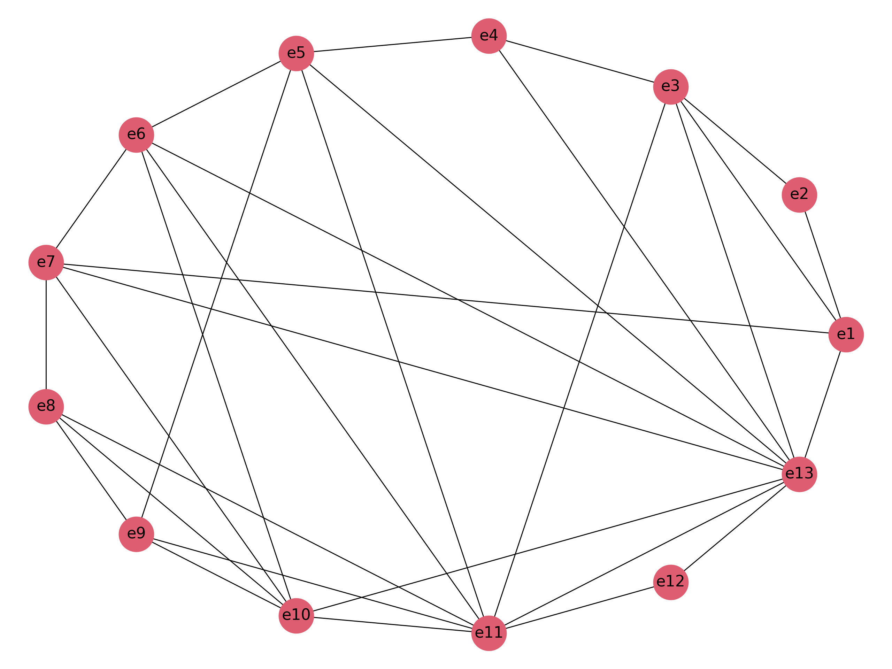
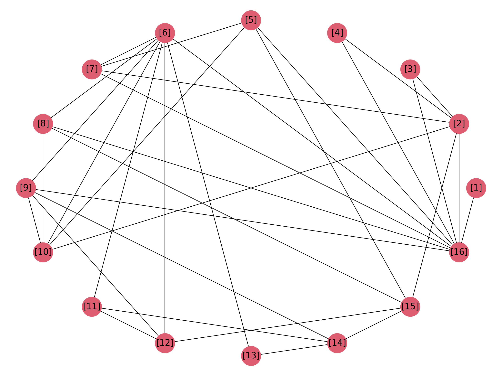
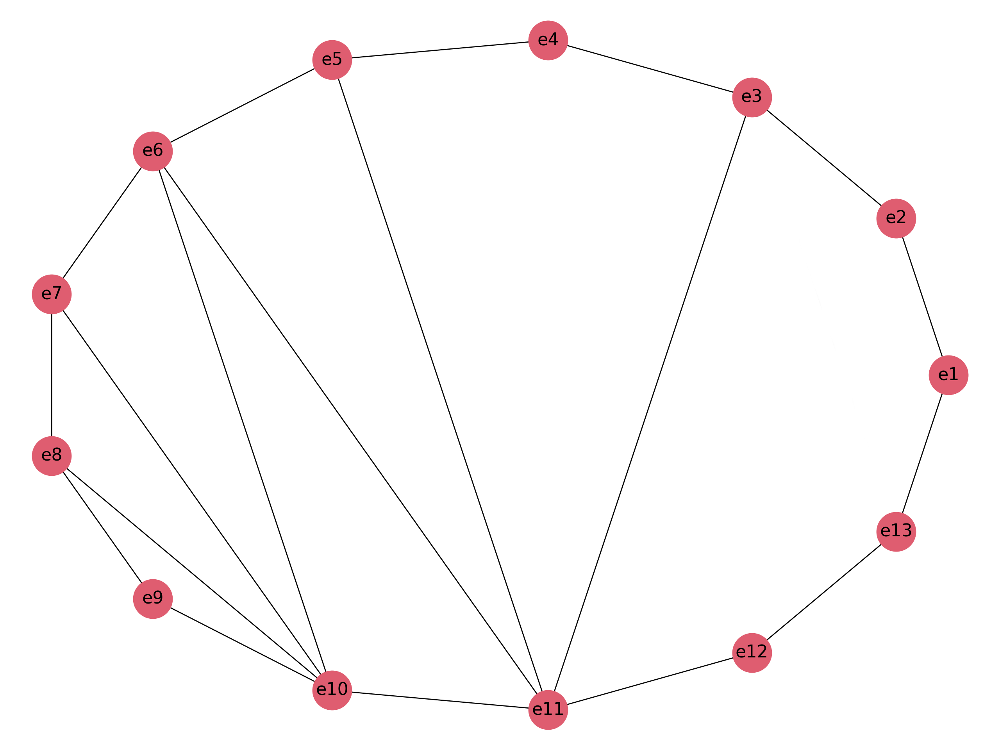
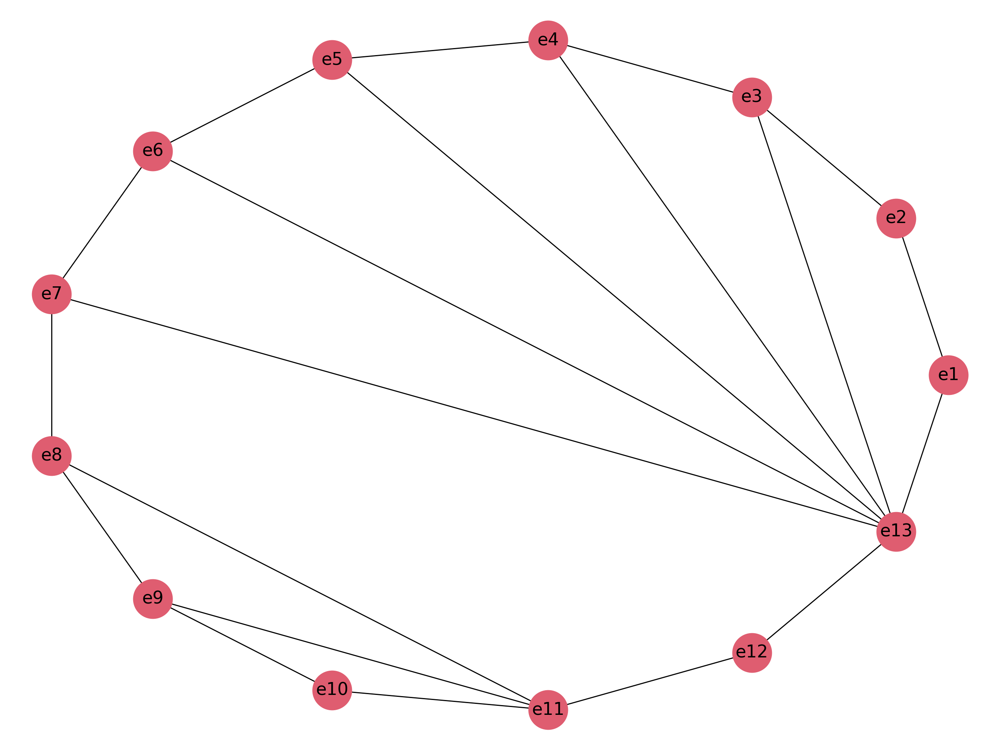
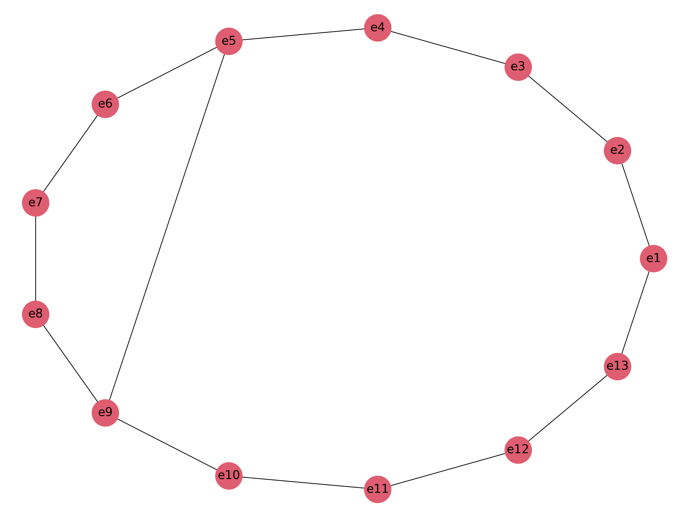
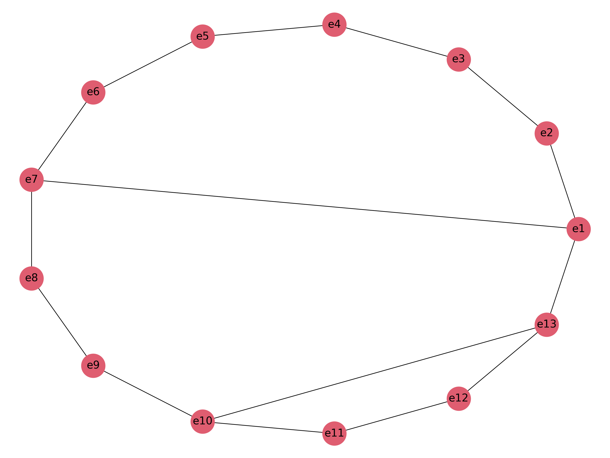

# Исходные данные

Цепей: 21 модулей: 13

Цепь Модуль /    Контакт
---- ----- ----- -------
1    13/5  7/2   8/2
2    1/9   3/14  10/9
3    12/12 13/10 11/9
4    9/9   5/12
5    12/5  8/5
6    13/8  6/14  12/10
7    5/10  13/6  12/7
8    13/7  1/2   7/13
9    12/1  9/2   4/8
10   13/12 8/7   5/4
11   7/5   4/3
12   13/13 10/6  12/3
13   13/11 11/12 8/3
14   13/1  12/11 11/7
15   12/6  6/5
16   11/13 11/4
17   8/8   7/8   11/8
18   13/3  12/9
19   11/5  9/3   4/11
20   10/11 2/5
21   13/4  5/2   2/12
---- ----- ----- -----

Матрица комплексов Q

          $e_{1}$ $e_{2}$ $e_{3}$ $e_{4}$ $e_{5}$ $e_{6}$ $e_{7}$ $e_{8}$ $e_{9}$ $e_{10}$    $e_{11}$    $e_{12}$    $e_{13}$
--------- ------- ------- ------- ------- ------- ------- ------- ------- ------- --------    --------    --------    --------
$u_{1}$   0       0       0       0       0       0       1       1       0       0           0           0           1
$u_{2}$   1       0       1       0       0       0       0       0       0       1           0           0           0
$u_{3}$   0       0       0       0       0       0       0       0       0       0           1           1           1
$u_{4}$   0       0       0       0       1       0       0       0       1       0           0           0           0
$u_{5}$   0       0       0       0       0       0       0       1       0       0           0           1           0
$u_{6}$   0       0       0       0       0       1       0       0       0       0           0           1           1
$u_{7}$   0       0       0       0       1       0       0       0       0       0           0           1           1
$u_{8}$   1       0       0       0       0       0       1       0       0       0           0           0           1
$u_{9}$   0       0       0       1       0       0       0       0       1       0           0           1           0
$u_{10}$  0       0       0       0       1       0       0       1       0       0           0           0           1
$u_{11}$  0       0       0       1       0       0       1       0       0       0           0           0           0
$u_{12}$  0       0       0       0       0       0       0       0       0       1           0           1           1
$u_{13}$  0       0       0       0       0       0       0       1       0       0           1           0           1
$u_{14}$  0       0       0       0       0       0       0       0       0       0           1           1           1
$u_{15}$  0       0       0       0       0       1       0       0       0       0           0           1           0
$u_{16}$  0       0       0       0       0       0       0       0       0       0           1           0           0
$u_{17}$  0       0       0       0       0       0       1       1       0       0           1           0           0
$u_{18}$  0       0       0       0       0       0       0       0       0       0           0           1           1
$u_{19}$  0       0       0       1       0       0       0       0       1       0           1           0           0
$u_{20}$  0       1       0       0       0       0       0       0       0       1           0           0           0
$u_{21}$  0       1       0       0       1       0       0       0       0       0           0           0           1
--------- ------- ------- ------- ------- ------- ------- ------- ------- ------- --------    --------    --------    --------

Матрица смежности R

         $e_{1}$ $e_{2}$ $e_{3}$ $e_{4}$ $e_{5}$ $e_{6}$ $e_{7}$ $e_{8}$ $e_{9}$ $e_{10}$ $e_{11}$ $e_{12}$ $e_{13}$
-------- ------- ------- ------- ------- ------- ------- ------- ------- ------- -------- -------- -------- --------
$e_{1}$  0       0       1       0       0       0       1       0       0       1        0        0        1
$e_{2}$  0       0       0       0       1       0       0       0       0       1        0        0        1
$e_{3}$  1       0       0       0       0       0       0       0       0       1        0        0        0
$e_{4}$  0       0       0       0       0       0       1       0       2       0        1        1        0
$e_{5}$  0       1       0       0       0       0       0       1       1       0        0        1        3
$e_{6}$  0       0       0       0       0       0       0       0       0       0        0        2        1
$e_{7}$  1       0       0       1       0       0       0       2       0       0        1        0        2
$e_{8}$  0       0       0       0       1       0       2       0       0       0        2        1        3
$e_{9}$  0       0       0       2       1       0       0       0       0       0        1        1        0
$e_{10}$ 1       1       1       0       0       0       0       0       0       0        0        1        1
$e_{11}$ 0       0       0       1       0       0       1       2       1       0        0        2        3
$e_{12}$ 0       0       0       1       1       2       0       1       1       1        2        0        6
$e_{13}$ 1       1       0       0       3       1       2       3       0       1        3        6        0
-------- ------- ------- ------- ------- ------- ------- ------- ------- ------- -------- -------- -------- --------

# Выполнение

## Поиск гамильтонова цикла

$S = \{e_{1}, e_{3}, e_{10}, e_{2}, e_{5}, e_{8}, e_{7}, e_{4}, e_{9}, e_{11}, e_{12}, e_{6}, e_{13}\}$

Перенумеруем вершины графа таким образом, чтобы ребра гамильтонова цикла были внешними:

------ ------- ------- -------- ------- ------- ------- ------- ------- ------- -------- -------- -------- --------
Старые $e_{1}$ $e_{2}$ $e_{3}$  $e_{4}$ $e_{5}$ $e_{6}$ $e_{7}$ $e_{8}$ $e_{9}$ $e_{10}$ $e_{11}$ $e_{12}$ $e_{13}$
Новые  $e_{1}$ $e_{3}$ $e_{10}$ $e_{2}$ $e_{5}$ $e_{8}$ $e_{7}$ $e_{4}$ $e_{9}$ $e_{11}$ $e_{12}$ $e_{6}$  $e_{13}$
------ ------- ------- -------- ------- ------- ------- ------- ------- ------- -------- -------- -------- --------

         $e_{1}$ $e_{2}$ $e_{3}$ $e_{4}$ $e_{5}$ $e_{6}$ $e_{7}$ $e_{8}$ $e_{9}$ $e_{10}$ $e_{11}$ $e_{12}$ $e_{13}$
-------- ------- ------- ------- ------- ------- ------- ------- ------- ------- -------- -------- -------- --------
$e_{1}$  0       1       1       0       0       0       1       0       0       0        0        0        1
$e_{2}$  1       0       1       0       0       0       0       0       0       0        0        0        0
$e_{3}$  1       1       0       1       0       0       0       0       0       0        1        0        1
$e_{4}$  0       0       1       0       1       0       0       0       0       0        0        0        1
$e_{5}$  0       0       0       1       0       1       0       0       1       0        1        0        3
$e_{6}$  0       0       0       0       1       0       2       0       0       2        1        0        3
$e_{7}$  1       0       0       0       0       2       0       1       0       1        0        0        2
$e_{8}$  0       0       0       0       0       0       1       0       2       1        1        0        0
$e_{9}$  0       0       0       0       1       0       0       2       0       1        1        0        0
$e_{10}$ 0       0       0       0       0       2       1       1       1       0        2        0        3
$e_{11}$ 0       0       1       0       1       1       0       1       1       2        0        2        6
$e_{12}$ 0       0       0       0       0       0       0       0       0       0        2        0        1
$e_{13}$ 1       0       1       1       3       3       2       0       0       3        6        1        0
-------- ------- ------- ------- ------- ------- ------- ------- ------- ------- -------- -------- -------- --------

Пересечения ребер:

------------------ ---------------- ---------------- ---------------- ---------------- ------------------
$e_{3}$-$e_{13}$:  $e_{1}$-$e_{7}$
$e_{3}$-$e_{11}$:  $e_{1}$-$e_{7}$
$e_{4}$-$e_{13}$:  $e_{1}$-$e_{7}$  $e_{3}$-$e_{11}$
$e_{5}$-$e_{13}$:  $e_{1}$-$e_{7}$  $e_{3}$-$e_{11}$
$e_{5}$-$e_{11}$:  $e_{1}$-$e_{7}$
$e_{5}$-$e_{9}$:   $e_{1}$-$e_{7}$
$e_{6}$-$e_{13}$:  $e_{1}$-$e_{7}$  $e_{3}$-$e_{11}$ $e_{5}$-$e_{11}$ $e_{5}$-$e_{9}$
$e_{6}$-$e_{11}$:  $e_{1}$-$e_{7}$  $e_{5}$-$e_{9}$
$e_{6}$-$e_{10}$:  $e_{1}$-$e_{7}$  $e_{5}$-$e_{9}$
$e_{7}$-$e_{13}$:  $e_{3}$-$e_{11}$ $e_{5}$-$e_{11}$ $e_{5}$-$e_{9}$  $e_{6}$-$e_{11}$ $e_{6}$-$e_{10}$
$e_{7}$-$e_{10}$:  $e_{5}$-$e_{9}$
$e_{8}$-$e_{11}$:  $e_{5}$-$e_{9}$  $e_{6}$-$e_{10}$ $e_{7}$-$e_{10}$
$e_{8}$-$e_{10}$:  $e_{5}$-$e_{9}$
$e_{9}$-$e_{11}$:  $e_{6}$-$e_{10}$ $e_{7}$-$e_{10}$ $e_{8}$-$e_{10}$
$e_{10}$-$e_{13}$: $e_{3}$-$e_{11}$ $e_{5}$-$e_{11}$ $e_{6}$-$e_{11}$ $e_{8}$-$e_{11}$ $e_{9}$-$e_{11}$
------------------ ---------------- ---------------- ---------------- ---------------- ------------------

Новая нумерация ребер:

---- ------------------
[1]  $e_{3}$-$e_{13}$
[2]  $e_{3}$-$e_{11}$
[3]  $e_{4}$-$e_{13}$
[4]  $e_{5}$-$e_{13}$
[5]  $e_{5}$-$e_{11}$
[6]  $e_{5}$-$e_{9}$
[7]  $e_{6}$-$e_{13}$
[8]  $e_{6}$-$e_{11}$
[9]  $e_{6}$-$e_{10}$
[10] $e_{7}$-$e_{13}$
[11] $e_{7}$-$e_{10}$
[12] $e_{8}$-$e_{11}$
[13] $e_{8}$-$e_{10}$
[14] $e_{9}$-$e_{11}$
[15] $e_{10}$-$e_{13}$
[16] $e_{1}$-$e_{7}$
---- ------------------

     [1] [2] [3] [4] [5] [6] [7] [8] [9] [10] [11] [12] [13] [14] [15] [16]
---- --- --- --- --- --- --- --- --- --- ---- ---- ---- ---- ---- ---- ----
[1]  1   0   0   0   0   0   0   0   0   0    0    0    0    0    0    1
[2]  0   1   1   1   0   0   1   0   0   1    0    0    0    0    1    1
[3]  0   1   1   0   0   0   0   0   0   0    0    0    0    0    0    1
[4]  0   1   0   1   0   0   0   0   0   0    0    0    0    0    0    1
[5]  0   0   0   0   1   0   1   0   0   1    0    0    0    0    1    1
[6]  0   0   0   0   0   1   1   1   1   1    1    1    1    0    0    1
[7]  0   1   0   0   1   1   1   0   0   0    0    0    0    0    0    1
[8]  0   0   0   0   0   1   0   1   0   1    0    0    0    0    1    1
[9]  0   0   0   0   0   1   0   0   1   1    0    1    0    1    0    1
[10] 0   1   0   0   1   1   0   1   1   1    0    0    0    0    0    0
[11] 0   0   0   0   0   1   0   0   0   0    1    1    0    1    0    0
[12] 0   0   0   0   0   1   0   0   1   0    1    1    0    0    1    0
[13] 0   0   0   0   0   1   0   0   0   0    0    0    1    1    0    0
[14] 0   0   0   0   0   0   0   0   1   0    1    0    1    1    1    0
[15] 0   1   0   0   1   0   0   1   0   0    0    1    0    1    1    0
[16] 1   1   1   1   1   1   1   1   1   0    0    0    0    0    0    1
---- --- --- --- --- --- --- --- --- --- ---- ---- ---- ---- ---- ---- ----

Cемейство максимальных внутренне устойчивых множеств $\psi_G$

----------- -- -- -- -- -- -- -- --
$\psi_{1}$  1  2  5  6  14
$\psi_{2}$  1  2  5  8  9  11 13
$\psi_{3}$  1  2  5  8  12 13
$\psi_{4}$  1  2  5  8  12 14
$\psi_{5}$  1  3  4  5  6  14
$\psi_{6}$  1  3  4  5  8  9  11 13
$\psi_{7}$  1  3  4  5  8  12 13
$\psi_{8}$  1  3  4  5  8  12 14
$\psi_{9}$  1  3  4  6  15
$\psi_{10}$ 1  3  4  7  8  9  11 13
$\psi_{11}$ 1  3  4  7  8  12 13
$\psi_{12}$ 1  3  4  7  8  12 14
$\psi_{13}$ 1  3  4  7  9  11 13 15
$\psi_{14}$ 1  3  4  7  10 11 13 15
$\psi_{15}$ 1  3  4  7  10 12 13
$\psi_{16}$ 1  3  4  7  10 12 14
$\psi_{17}$ 10 11 13 15 16
$\psi_{18}$ 10 12 13 16
$\psi_{19}$ 10 12 14 16
----------- -- -- -- -- -- -- -- --

Для каждой пары множеств вычислим значение критерия $α_{γδ} = |\psi_γ| + |\psi_δ| - |\psi_γ \cup \psi_δ|$.

Результаты вычислений запишем в матрицу $Α = ||α_{γδ}||$.

            $\psi_{1}$ $\psi_{2}$ $\psi_{3}$ $\psi_{4}$ $\psi_{5}$ $\psi_{6}$ $\psi_{7}$ $\psi_{8}$ $\psi_{9}$ $\psi_{10}$ $\psi_{11}$ $\psi_{12}$ $\psi_{13}$ $\psi_{14}$ $\psi_{15}$ $\psi_{16}$ $\psi_{17}$ $\psi_{18}$ $\psi_{19}$
----------- ---------- ---------- ---------- ---------- ---------- ---------- ---------- ---------- ---------- ----------- ----------- ----------- ----------- ----------- ----------- ----------- ----------- ----------- -----------
$\psi_{1}$  0          9          8          7          7          11         10         9          8          12          11          10          12          12          11          10          10          9           8
$\psi_{2}$             0          8          9          11         9          10         11         11         10          11          12          11          12          12          13          10          10          11
$\psi_{3}$                        0          7          10         10         8          9          10         11          9           10          12          12          10          11          10          8           9
$\psi_{4}$                                   0          9          11         9          8          10         12          10          9           13          13          11          10          11          9           8
$\psi_{5}$                                              0          10         9          8          7          11          10          9           11          11          10          9           11          10          9
$\psi_{6}$                                                         0          9          10         10         9           10          11          10          11          11          12          11          11          12
$\psi_{7}$                                                                    0          8          9          10          8           9           11          11          9           10          11          9           10
$\psi_{8}$                                                                               0          9          11          9           8           12          12          10          9           12          10          9
$\psi_{9}$                                                                                          0          10          9           9           9           9           9           9           9           9           9
$\psi_{10}$                                                                                                    0           9           10          9           10          10          11          11          11          12
$\psi_{11}$                                                                                                                0           8           10          10          8           9           11          9           10
$\psi_{12}$                                                                                                                            0           11          11          9           8           12          10          9
$\psi_{13}$                                                                                                                                        0           9           10          11          10          11          12
$\psi_{14}$                                                                                                                                                    0           9           10          9           10          11
$\psi_{15}$                                                                                                                                                                0           8           10          8           9
$\psi_{16}$                                                                                                                                                                            0           11          9           8
$\psi_{17}$                                                                                                                                                                                        0           6           7
$\psi_{18}$                                                                                                                                                                                                    0           5
$\psi_{19}$                                                                                                                                                                                                                0
----------- ---------- ---------- ---------- ---------- ---------- ---------- ---------- ---------- ---------- ----------- ----------- ----------- ----------- ----------- ----------- ----------- ----------- ----------- -----------

Наибольшее значение функция принимает на паре ψ2 -- ψ16, равное 13
Убираем рёбра, содержащиеся в ψ2 или ψ16

Остается:

$$\psi'1 = \{6, 15\}$$
$$\psi'2 = \{15, 16\}$$

Найдём новую матрицу Α:

         $\psi'1$ $\psi'2$
-------- -------- --------
$\psi'1$ 0        3
$\psi'2$          0
-------- -------- --------

Наибольшее значение функция принимает на паре ψ'1 -- ψ'2, равное 3
Убираем рёбра, содержащиеся в ψ'1 или ψ'2

Новое семейство пустое.
Все рёбра реализованы.

Итоговая толщина графа m = 2

Планарные графы см. в приложении.

Проверка изоморфизма графов

Критерий                  Исходная матрица                        Преобразованная матрица                 Соответствие
------------------------- --------------------------------------- --------------------------------------- ------------
Число вершин m            13                                      13                                      +
Число рёбер k             31                                      31                                      +
Компоненты связности p(g) 1                                       1                                       +
Cтепени вершин            [9, 8, 6, 5, 5, 5, 5, 4, 4, 4, 3, 2, 2] [9, 8, 6, 5, 5, 5, 5, 4, 4, 4, 3, 2, 2] +
------------------------- --------------------------------------- --------------------------------------- ------------

По основным инвариантам графы совпадают.

Разобьем вершины на классы по их степеням:

- ------------- ------------
9 [13]          [13]
8 [12]          [11]
6 [11]          [10]
5 [5, 7, 8, 10] [3, 5, 6, 7]
4 [1, 4, 9]     [1, 8, 9]
3 [2]           [4]
2 [3, 6]        [2, 12]
- ------------- ------------

Точные соответствия

X  Y
-- --
13 13
12 11
11 10
2  4
-- --

Cвяжем установленные вершины с неустановленными вершинами.

X  X  Y  Y
-- -- -- --
13 5  13 3
12 7  11 5
11 8  10 6
2  10 4  7
   1     1
   4     8
   9     9
   3     2
   6     12
-- -- -- --

У графа есть вершины с нечётным количеством смежных рёбер. Дополним граф так, чтобы их не было.

## Измененный граф

         $e_{1}$ $e_{2}$ $e_{3}$ $e_{4}$ $e_{5}$ $e_{6}$ $e_{7}$ $e_{8}$ $e_{9}$ $e_{10}$ $e_{11}$ $e_{12}$ $e_{13}$
-------- ------- ------- ------- ------- ------- ------- ------- ------- ------- -------- -------- -------- --------
$e_{1}$  0       0       1       0       0       0       1       0       0       1        0        0        1
$e_{2}$  0       0       0       0       1       0       1       0       0       1        0        0        1
$e_{3}$  1       0       0       0       0       0       0       0       0       1        0        0        0
$e_{4}$  0       0       0       0       0       0       1       0       1       0        1        1        0
$e_{5}$  0       1       0       0       0       0       0       1       1       1        0        1        1
$e_{6}$  0       0       0       0       0       0       0       0       0       0        0        1        1
$e_{7}$  1       1       0       1       0       0       0       1       0       0        1        0        1
$e_{8}$  0       0       0       0       1       0       1       0       0       0        1        1        1
$e_{9}$  0       0       0       1       1       0       0       0       0       0        1        1        0
$e_{10}$ 1       1       1       0       1       0       0       0       0       0        0        1        1
$e_{11}$ 0       0       0       1       0       0       1       1       1       0        0        1        1
$e_{12}$ 0       0       0       1       1       1       0       1       1       1        1        0        1
$e_{13}$ 1       1       0       0       1       1       1       1       0       1        1        1        0
-------- ------- ------- ------- ------- ------- ------- ------- ------- ------- -------- -------- -------- --------

## Эйлеров цикл:

--------------------------------------------------------------
$e_{8}$ $e_{5}$ $e_{2}$ $e_{7}$ $e_{1}$ $e_{3}$ $e_{10}$ $e_{1}$ $e_{13}$ $e_{2}$ $e_{10}$ $e_{5}$ $e_{9}$ $e_{4}$ $e_{7}$ $e_{8}$ $e_{11}$ $e_{4}$ $e_{12}$
$e_{5}$ $e_{13}$ $e_{6}$ $e_{12}$ $e_{8}$ $e_{13}$ $e_{7}$ $e_{11}$ $e_{9}$ $e_{12}$ $e_{10}$ $e_{13}$ $e_{11}$ $e_{12}$ $e_{13}$ $e_{8}$
--------------------------------------------------------------

## Приложение
