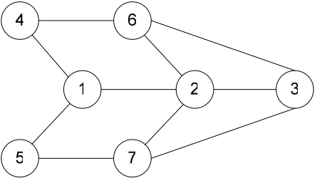

# Цель работы.

Расшифровать криптограмму, зашифрованную методом перестановок, получить ключ
шифрования.

Расшифровать криптограмму, зашифрованную методом перестановок по путям
Гамильтона, получить ключ шифрования.

Расшифровать криптограмму, зашифрованную методом табличной перестановки,
пользуясь для этой цели таблицей частот диграмм русского языка, получить ключ
шифрования.

# Выполнение

## Метод диграмм

### Криптограмма
\begin{verbatim}
СКВА АХЗ КМИИФ  ВАОХОЖЗНМПЕАР ТАЕНСКАО ВЖЕСТЮХ НКЫСТОРНЦИУЙКОС ТСЛЯАЮВХ
ЩЭИМЕЛНЕРНТЫАЕДЕИ ЦЫН ИПРНИАР МЮЕШАН ОГ МВОРЕСТТЬ ИСТРИТКАИ АД ПООХ ЕНИИЩДЕЯВ
КИУ Ш ННЕОЗЯЛ ЬРЕПСЕВЛТЯА ЭТЛЬЕНЕТМВНЫУ И ТТРИХА КИНЕИДОТЦР АНИИЦДЕЕЙ ВИСЯТСЕ
ГВ ИДДА ПЕОТЕ СЕЛ ПГРОЕНИЕМЯ НКИДОАЕЖТР ИОНИЦЕАВЯ ЗСО АСНЕК ОНРЫТМОУН
КФОНЦАИНЫЛМЬТР ИАТОБМУИС ТСЫЗЕЮМ
\end{verbatim}

### Открытый текст

\begin{verbatim}
В СКАЗКАХ И МИФАХ ВОЗМОЖНА ПЕРЕСТАНОВКА СЮЖЕТНЫХ КОНСТРУКЦИЙ СОСТАВЛЯЮЩИХ
ЭЛЕМЕНТАРНЫЕ ЕДИНИЦЫ НАПРИМЕР ЮНОША МОГ ВСТРЕТИТЬ СТАРИКА И ДО ПОХИЩЕНИЯ
ДЕВУШКИ НО НЕЛЬЗЯ ПЕРЕСТАВЛЯТЬ ЭЛЕМЕНТЫ ВНУТРИ ТАКИХ ЕДИНИЦ ОТРИЦАНИЕ ДЕЙСТВИЯ
ВСЕГДА ИДЕТ ПОСЛЕ ЕГО ПРИМЕНЕНИЯ КАЖДОЕ ОТРИЦАНИЕ СВЯЗАНО С НЕКОТОРЫМ
ФУНКЦИОНАЛЬНЫМ АТРИБУТОМ СИСТЕМЫЗЮ
\end{verbatim}

### Ключ

\begin{verbatim}
34152
\end{verbatim}

### Протокол криптоанализа

Определим длину ключа. Предположим, длина ключа равна 5.
Установим автоматический режим генерации
ключей. После нескольких попыток генерации значения ключа в тексте обнаруживалось
сочетание букв, напоминающее (при простой перестановке) слово «ТОЛЬКО». Введём
его как вероятное слово. В результате получается ключ «34152» и расшифрованный
текст.

## Криптоанализ перестановок, зашифрованных по маршруту Гамильтона

### Криптограмма
\begin{verbatim}
В ОТОСЛК ЬОООЛОКЛАЧБОЕКЛАН ПУ ВПК ЗО ТНЙУС ЕВМНО ЕСЬЯТ БЗВОАО РОКТАЧЯ РНТНА ССЕ
ТВЫМЯОСГ ИТ ЬМЕБНЕ ИЯЛЖТСВЕ ТЬКАЖВ ЧИСЯАТ Е ИКИД Е БЕНТ  ЕЛА  ОСВЧТЧЕО КОРЙСОЧ
ТВЛВТЧИАСПЯ ВОИКТЯЕ СЛЯСЕ ТВНААТЛЬС В ЕТКВ ОСЬЕ ТА ЛВСАОУ У  ЕЖ И ЫИ ТСЛТИЭ
ПОД ГПАКО РИУДУТОУГ  ГОЯНБА ТЕЕЕВ Т СЧШТЯОНЕ

\end{verbatim}

### Открытый текст

\begin{verbatim}
СЛОВО ТОЛЬКО ОБОЛОЧКА ПЛЕНКА ЗВУК ПУСТОЙ НО В НЕМ БЬЕТСЯ РОЗОВАЯ ТОЧКА СТРАННЫМ
СВЕТИТСЯ ОГНЕМ БЬЕТСЯ ЖИЛКА ВЬЕТСЯ ЖИВЧИК А ТЕБЕ И ДЕЛА НЕТ ЧТО В СОРОЧКЕ ТВОЙ
СЧАСТЛИВЧИК ПОЯВЛЯЕТСЯ НА СВЕТ ВЛАСТЬ ОТ ВЕКА ЕСТЬ У СЛОВА И УЖ ЕСЛИ ТЫ ПОЭТ И
КОГДА ПУТИ ДРУГОГО У ТЕБЯ НА СВЕТЕ НЕТЧОШЯ
\end{verbatim}

### Ключ

\begin{verbatim}
4637512
\end{verbatim}

### Протокол криптоанализа

Программа вычислила по матрице смежные пути Гамильтона для нашего графа. Будем
испытывать эти пути Гамильтона в качестве ключей перестановки. В итоге
криптограмма расшифрована.

## Криптоанализ табличных перестановок

### Криптограмма
\begin{verbatim}
РК О КТАНАЯВЫ  ЗОУИ М ЗЛДЕ УНОСГЖУ НИАККИКИПР  УИМТВШСИОНСКОК  Ь
\end{verbatim}

### Открытый текст

\begin{verbatim}
КАК ТО РАЗ Я ВЫНУЛ ИЗ МОЕГО СУНДУКА КНИЖКУ И ПРИМОСТИВШИСЬ К ОКН
\end{verbatim}

### Ключ

\begin{verbatim}
28637451
\end{verbatim}

### Протокол криптоанализа

Программа вычислила оценки вероятностей следования строк друг за другом и
поместила их в таблицу. Из таблицы видно, что максимальные вероятности у пар
строк: 1-6 2-8 3-6 4-7 5-1 6-3 7-4 8-6

Сделаем замены строк 2-8, 6-3, 7-4, ориентируясь по предпоследнему столбцу, т.к.
там нет пробелов, а на следующей строке есть мягкий знак, что позволяет нам
предположить, что в столбце глагол. После перестановок получаем слово
"мостившись" со следующим порядком строк: 2-8, 6-3, 1-4, 5-7, однако текст не
расшифрован. Замечаем большие вероятности у пар 7-4 и 5-1, меняем и получаем
расшифрованную криптограмму.
