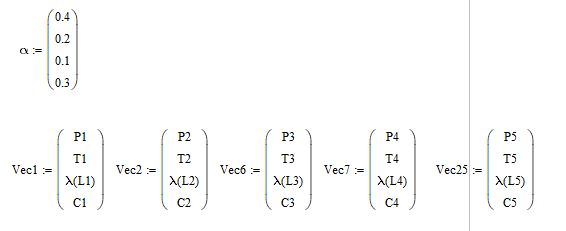

# Многокритериальный выбор структуры вычислительной системы

# Исходные данные

# Выполнение

## Расчет надежности структур

## Расчет $\lambda$ для каждой из структур

## Расчет среднего времени пребывания в каждой из структур

## Расчет стоимостей структур

## Полученные вектора (P,T,λ,C)

Все вектора составляют область эффективных решений (область Парето).

## Минимаксный критерий

Необходимо перейти к одинаковой природе критериев, пусть все критерии будут чем меньше тем лучше.

Далее необходимо нормализовать критерии:

Таким образом, наилучшей структурой является структура 6.

## Аддитивный критерий

Для аддитивного критерия необходимо ввести ранжирование:

Необходима нормализация:

Таким образом, по данному критерию наилучшей структурой будет структура 7.

## Мультипликативный критерий

Таким образом, при использовании мультипликативного критерия лучшей структурой будет структура 7

## Метод отклонения от идеала

Для данного метода необходимо ввести идеальные значения критериев

Затем провести нормализацию

При данном критерии выбора, наилучшая структура 25.

# Вывод

В ходе проведенного исследования можно выделить 3 конкурирующих структуры: 6, 7 и 25.
Структура 6 предпочтительна при использовании минимаксного критерия, однако данный критерий не учитывает веса локальных критериев.
По аддитивному и мультипликативному критерию предпочтительна структура 7.
При использовании же критерия отклонения от идеала структура 25 была получена самой эффективной.

Исходя из графиков функций среднего времени нахождения в сети, структура 25 предпочтительнее, так как при увеличении интенсивности запросов время пребывания в системе растет медленнее, чем в остальных случаях.

Однако структура 25 самая дорогостоящая, что немаловажно.
Исходя из всех полученных результатов выбираем структуру 7, так как надежность этой структуры достаточна высока, стоимость ниже чем в случаях структур 25 и 6. Функция зависимости среднего времени пребывания от интенсивности запросов растет быстрее, чем при использовании структуры 25, но медленнее чем при использовании структуры 6. Исходя из всех перечисленных преимуществ, наиболее предпочтительным вариантом будем считать структуру 7.  
Повысить надежность и уменьшить загрузку узлов можно при увеличении количества элементов, однако стоимость в этом случае повысится.
