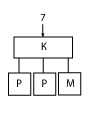
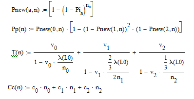
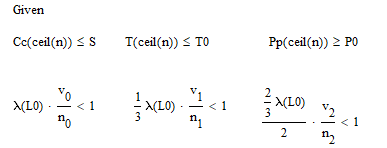
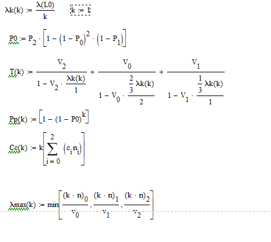
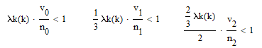

# Многокритериальное оптимальное проектирование

# Исходные данные

\begin{tabular}{lll}
\(P_r=0.9\)& \(P_m=0.92\)& \(P_k=0.99\) \\
\(C_r=5\) &\(C_m=6\) &\(C_k=1\) \\
\(V_r=4\)& \(V_m=2\)& \(V_k=1\)\\
\(\lambda=0.8\lambda_0\) & \(S=100\)\\
\textbf{Исходная структура:} & 7\\
\end{tabular}

# Поэлементное резервирование узлов

\textbf{Данные для расчетов:}
\bigskip

\begin{tabular}{llll}
    \(n:=
       \left (\begin{array}{c}
            1\\
            2\\
            1\\
       \end{array}\right)\) & \(c:=
       \left (\begin{array}{c}
            1\\
            5\\
            6\\
       \end{array}\right)\)& \(v:=
       \left (\begin{array}{c}
            1\\
            4\\
            2\\
       \end{array}\right)\) & \(P:=
       \left (\begin{array}{c}
            0.99\\
            0.9\\
            0.92\\
       \end{array}\right)\)\\[10mm]
       \(C0:=17\) & \(T0:=25.833\) & \(P0:=0.9892\) & \(S:=100\)
\end{tabular}

img

\newpage
\subsection{Главный критерий}

В качестве главного критерия возьмем надежность системы.
\bigskip

$$Pmax:=Maximize(P,n)$$
$$Pmax:=ceil(Pmax)=\left(\begin{array}{c}
    73 \\
    3 \\
    2 \\
    \end{array}\right)
$$
$$P(Pmax)=0.9999999936$$
$$T(Pmax)=8.9628327474$$
$$C(Pmax)=100$$
$$\lambda max(Pmax)=0.75$$

\subsection{Мультипликативный критерий}

$$Mmax(n):=\frac{P(n)\cdot\lambda max(n)}{C(n)T(n)}$$

$$a:=Maximize(Mmax,n)$$
$$a:=ceil(a)=\left(\begin{array}{c}
    4 \\
    12 \\
    6 \\
    \end{array}\right)
$$
$$P(a)=0.9999999$$
$$T(a)=7.6050420168$$
$$C(a)=100$$
$$\lambda max(a)=3$$

\subsection{Аддитивный критерий}

$$\alpha:=\left(\begin{array}{c}
    0.33 \\
    0.33 \\
    0.33 \\
    \end{array}\right)
$$

$$A(n):=\alpha_0 P(n)-\alpha_1 \frac{C(n)}{S} - \alpha_2 \frac{T(n)}{T0}$$

$$a:=Maximize(A,n)$$
$$a:=ceil(a)=\left(\begin{array}{c}
    3 \\
    3 \\
    2 \\
    \end{array}\right)
$$
$$P(a)=0.9999989936$$
$$T(a)=9.2045454545$$
$$C(a)=30$$
$$\lambda max(a)=0.75$$

\subsection{Метод отклонения от идеала}

$$Tid:=\sum_{i=0}^3 v_i = 7$$
$$Cid:=\sum_{i=0}^3 c_i = 12$$
$$Tid:=1$$

$$OI(n):=(Pid-P(n))^2 + \left(\frac{Tid-T(n)}{Tid-T0}\right)^2 +\left(\frac{Cid-C(n)}{Cid-S}\right)^2$$

$$a:=Maximize(OI,n)$$
$$a:=ceil(a)=\left(\begin{array}{c}
    1 \\
    1 \\
    1 \\
    \end{array}\right)
$$
$$P(a)=0.989208$$
$$T(a)=25.833$$
$$C(a)=12$$
$$\lambda max(a)=0.25$$

\subsection{Метод последовательной уступки}

\textbf{Первый шаг: максимизируем надежность}

$$ap:=Maximize(P,n)$$
$$ap:=ceil(ap)=\left(\begin{array}{c}
    73 \\
    3 \\
    2 \\
    \end{array}\right)
$$

Введем допуск на надежность в 5\%:
$$Px:=0.95P(ap)=0.9499999939$$

\textbf{Второй шаг: минимизируем стоимость}

$$ac:=Minimize(C,n)$$
$$ac:=ceil(ac)=\left(\begin{array}{c}
    1 \\
    1 \\
    1 \\
    \end{array}\right)
$$

Введем допуск на стоимость в 10\%:
$$Cx:=1.1C(ac)=13.2$$

\textbf{Третий шаг: минимизируем время}

$$at:=Minimize(T,n)$$
$$at:=ceil(at)=\left(\begin{array}{c}
    2 \\
    1 \\
    1 \\
    \end{array}\right)
$$

$$P(at)=0.99910008$$
$$T(at)=24.7619047619$$
$$C(at)=13$$
$$\lambda max(at)=0.25$$

\subsection{Метод STEM}

Преобразуем значения, чтобы они были, чем больше, тем лучше:

$$T2(n):=T0-T(n)$$
$$C2(n):=S-C(n)$$

\textbf{Оптимизируем по надежности}

$$Pmax:=Maximize(P,n)$$
$$Pmax:=ceil(Pmax)$$
$$P(T2max)=0.9999999936$$
$$T2(T2max)=16.870500586$$
$$C2(T2max)=0$$
$$\lambda max(T2max)=0.75$$

\textbf{Оптимизируем по времени}

$$T2max:=Maximize(T2,n)$$
$$T2max:=ceil(T2max)$$
$$P(T2max)=0.9999999999$$
$$T2(T2max)=18.2575757576$$
$$C2(T2max)=0$$
$$\lambda max(T2max)=2$$

\textbf{Оптимизируем по стоимости}

$$С2max:=Maximize(С2,n)$$
$$С2max:=ceil(С2max)$$
$$P(С2max)=0.989208$$
$$T2(С2max)=0$$
$$C2(С2max)=88$$
$$\lambda max(С2max)=0.25$$

\textbf{Нормированная матрица}

$$Ci:=\left(\begin{array}{ccc}
    \frac{P(Pmax)}{P(Pmax)}  & \frac{T2(Pmax)}{T2(T2max)} & \frac{C2(Pmax)}{C2(C2max)}\\
    \frac{P(T2max)}{P(Pmax)} & \frac{T2(T2max)}{T2(T2max)} &\frac{C2(T2max)}{C2(C2max)}\\
    \frac{P(c2max)}{P(Pmax)} &\frac{T2(C2max)}{T2(T2max)} & \frac{C2(C2max)}{C2(C2max)}\\
\end{array}\right)=
\left(\begin{array}{ccc}
    1 & 0.924 & 0\\
    1 & 1 & 0\\
    0.989 & 0 & 1\\
\end{array}\right)$$

Средние значения столбцов без диагональных элементов:

$$\alpha:=\left(\begin{array}{c}
     0.995\\
     0.462\\
     0.000\\
\end{array}\right)$$

$$Find(\lambda)=\left(\begin{array}{c}
     0.0034962133\\
     0.3485761735\\
     0.6479276132\\
\end{array}\right)$$

\textbf{Аддитивный критерий}

$$A(n):=\lambda_0 P(n)+\lambda_1 \frac{C2(n)}{S} - \lambda_2 \frac{T2(n)}{T0}$$

$$a:=Maximize(A,n)$$
$$a:=ceil(a)=\left(\begin{array}{c}
     3\\
     3\\
     2\\
\end{array}\right)$$
$$P(a)=0.9999989936$$
$$T2(a)=16.6287878788$$
$$C2(a)=70$$
$$\lambda max(a)=0.75$$

\begin{tabular}{|l|c|c|c|c|}
\hline
Задача & P & T & C\\[2mm]\hline
Локальная & 0.99 & 18.2575757 & 88\\[2mm]\hline
Глобальная & 0.99 & 16.629878787 & 70\\[2mm]\hline
\end{tabular}

\section{Общее резервирование}

\textbf{Данные для расчетов}

\begin{tabular}{llll}
    \(n:=
       \left (\begin{array}{c}
            1\\
            2\\
            1\\
       \end{array}\right)\) & \(c:=
       \left (\begin{array}{c}
            1\\
            5\\
            6\\
       \end{array}\right)\)& \(v:=
       \left (\begin{array}{c}
            1\\
            4\\
            2\\
       \end{array}\right)\) & \(P:=
       \left (\begin{array}{c}
            0.99\\
            0.9\\
            0.92\\
       \end{array}\right)\)\\[10mm]
       \(C0:=17\) & \(T0:=25.833\) & \(P0:=0.9892\) & \(S:=100\)
\end{tabular}

\subsection{Мультипликативный критерий}

$$Mmax(k):=\frac{P(k)\cdot\lambda max(k)}{C(k)T(k)}$$

$$a:=Maximize(Mmax,k)$$
$$a:=ceil(a)=1$$
$$P(a)=0.989$$
$$T(a)=25.8333$$
$$C(a)=17$$
$$\lambda max(a)=0.5$$

\subsection{Аддитивный критерий}

$$\alpha:=\left(\begin{array}{c}
    0.33 \\
    0.33 \\
    0.33 \\
    \end{array}\right)
$$

$$A(k):=\alpha_0 P(k)-\alpha_1 \frac{C(k)}{S} - \alpha_2 \frac{T(k)}{T0}$$

$$a:=Maximize(A,k)$$
$$a:=ceil(a)=1$$
$$P(a)=0.989$$
$$T(a)=25.8333$$
$$C(a)=17$$
$$\lambda max(a)=0.5$$

\section{Результаты и выводы}

Критерий                    $n_0$ $n_1$ $n_2$ $P$   $T$    $C$    $λ_{max}$
--------------------------- ----- ----- ----- ----- ------ ------ ---------
Поэлементное резервирование
Гл.критерий                 73    3     2     0.99  8.96   100    0.75
Мультипликативный           4     12    6     0.99  7.605  100    3
Аддитивный                  3     3     2     0.99  9.204  30     0.75
Отклонение от идеала        1     1     1     0.98  25.83  12     0.25
Последовательной уступки    2     1     1     0.99  24.76  13     0.25
STEM                        3     3     2     0.99  16.62  70     0.75
Общее резервирование
Мультипликативный           1     1     1     0.98  25.83  17     0.75
Аддитивный                  1     1     1     0.98  25.83  17     0.75
--------------------------- ----- ----- ----- ----- ------ ------ ---------

\bigskip

# Вывод

В результате расчетов получились достаточно разные результаты оптимизации
структуры по различным критериям. Так как все варианты подходят в рамки
заданных нами ограничений, то постараемся сделать субъективный выбор и
определить наиболее подходящий вариант построения системы. Таким образом,
предпочтение отдадим системе, полученной в следствии общего резервировании при
оптимизации по мультипликативному критерию, так как данная структура обладает
хорошей надежностью, самым маленьким временем пребывания заявок и наибольшим
максимальным потоком запросов. При этом стоимость данной системы не превышает 100.
