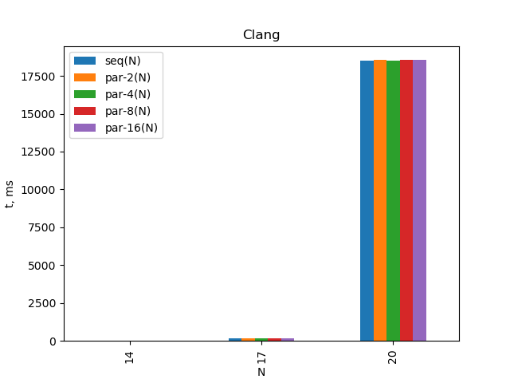
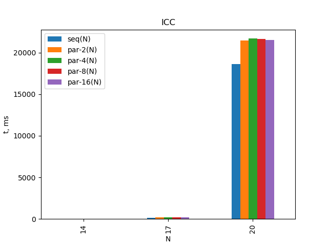

# Цель работы

На компьютере с многоядерным процессором установить ОС Linux
и компилятор GCC версии не ниже 4.7.2. При невозможности устано-
вить Linux или отсутствии компьютера с многоядерным процессором
можно выполнять лабораторную работу на виртуальной машине.
Скомпилировать написанную программу, используя встроенное в
gcc средство автоматического распараллеливания Graphite с помощью
следующей команды "/home/user/gcc -O2 -Wall -Werror -floopparallelize-
all -ftree-parallelize-loops=K lab1.c -o lab1-par-K" (переменной K по-
очерёдно присвоить хотя бы 4 различных целых значений, выбор
обосновать).

## Вариант:

Айтуганов: 9

Дмитрий: 7

Андреевич: 9

A: 567

Вариант Задание
------- ----------------------------------------------------------------------
4       Гиперболический котангенс корня числа
4       Модуль котангенса
4       Выбор большего (т.е. $M2[i] = max(M1[i],M2[i]))$)
4       Stupid Sort

N1 = 14

N2 = 20

# Конфигурация

## Процессор

```
CPU(s):                          16
On-line CPU(s) list:             0-15
Thread(s) per core:              2
Core(s) per socket:              8
Socket(s):                       1
NUMA node(s):                    1
Vendor ID:                       AuthenticAMD
Model name:                      AMD Ryzen 7 1700 Eight-Core Processor
CPU MHz:                         2645.861
CPU max MHz:                     3000.0000
CPU min MHz:                     1550.0000
```

RAM: 32 GB

## Компиляторы

```
gcc (GCC) 9.1.0
clang version 8.0.0
icc (ICC) 19.0.5.281 20190815
```

# Исходный код

\begin{footnotesize}
\verbatiminput{../src/main.c}
\end{footnotesize}

# Результаты

## GCC

Использованные флаги компиляции:

```
-O3 -floop-parallelize-all -ftree-parallelize-loops=${THREADS}
```

### Последовательное выполнение

        $N1 + \delta$   $N1 + \delta$    $N2$
------- --------------- ---------------- ----------------
N       14              17               20
seq(N)  18              166              19280
X       5.580714e-02    -5.985867e-03    3.367889e-02
------- --------------- ---------------- ----------------

### Выполнение при 2 потоках

           $N1 + \delta$   $N1 + \delta$    $N2$
---------- --------------- ---------------- ----------------
N          14              17               20
par-2(N)   19              160              19309
X          5.580714e-02    -5.985867e-03    3.367889e-02
---------- --------------- ---------------- ----------------

### Выполнение при 4 потоках

           $N1 + \delta$   $N1 + \delta$    $N2$
---------- --------------- ---------------- ----------------
N          14              17               20
par-4(N)   35              165              19251
X          5.580714e-02    -5.985867e-03    3.367889e-02
---------- --------------- ---------------- ----------------

### Выполнение при 8 потоках

           $N1 + \delta$   $N1 + \delta$    $N2$
---------- --------------- ---------------- ----------------
N          14              17               20
par-8(N)   21              165              19376
X          5.580714e-02    -5.985867e-03    3.367889e-02
---------- --------------- ---------------- ----------------

### Выполнение при 16 потоках

           $N1 + \delta$   $N1 + \delta$    $N2$
---------- --------------- ---------------- ----------------
N          14              17               20
par-16(N)  19              162              19376
X          5.580714e-02    -5.985867e-03    3.367889e-02
---------- --------------- ---------------- ----------------


.

\begin{center}
Зависимость времени выполнения от N
\end{center}

## Clang

Использованные флаги компиляции:

```
-O3 -mllvm -polly -mllvm -polly-parallel -mllvm
-polly-num-threads=${THREADS}
```

### Последовательное выполнение

        $N1 + \delta$   $N1 + \delta$    $N2$
------- --------------- ---------------- ----------------
N       14              17               20
seq(N)  28              169              18510
X       5.580714e-02    -5.985867e-03    3.367889e-02
------- --------------- ---------------- ----------------

### Выполнение при 2 потоках

           $N1 + \delta$   $N1 + \delta$    $N2$
---------- --------------- ---------------- ----------------
N          14              17               20
par-2(N)   19              155              18536
X          5.580714e-02    -5.985867e-03    3.367889e-02
---------- --------------- ---------------- ----------------

### Выполнение при 4 потоках

           $N1 + \delta$   $N1 + \delta$    $N2$
---------- --------------- ---------------- ----------------
N          14              17               20
par-4(N)   24              160              18527
X          5.580714e-02    -5.985867e-03    3.367889e-02
---------- --------------- ---------------- ----------------

### Выполнение при 8 потоках

           $N1 + \delta$   $N1 + \delta$    $N2$
---------- --------------- ---------------- ----------------
N          14              17               20
par-8(N)   20              154              18539
X          5.580714e-02    -5.985867e-03    3.367889e-02
---------- --------------- ---------------- ----------------

### Выполнение при 16 потоках

           $N1 + \delta$   $N1 + \delta$    $N2$
---------- --------------- ---------------- ----------------
N          14              17               20
par-16(N)  22              167              18548
X          5.580714e-02    -5.985867e-03    3.367889e-02
---------- --------------- ---------------- ----------------


.

\begin{center}
Зависимость времени выполнения от N
\end{center}

## ICC

Использованные флаги компиляции:

```
-O3 -parallel -par-threshold=${THREADS}
```

### Последовательное выполнение

        $N1 + \delta$   $N1 + \delta$    $N2$
------- --------------- ---------------- ----------------
N       14              17               20
seq(N)  41              149              18611
X       5.580714e-02    -5.985867e-03    3.367889e-02
------- --------------- ---------------- ----------------

### Выполнение при 2 потоках

           $N1 + \delta$   $N1 + \delta$    $N2$
---------- --------------- ---------------- ----------------
N          14              17               20
par-2(N)   18              179              21446
X          5.580714e-02    -5.985867e-03    3.367889e-02
---------- --------------- ---------------- ----------------

### Выполнение при 4 потоках

           $N1 + \delta$   $N1 + \delta$    $N2$
---------- --------------- ---------------- ----------------
N          14              17               20
par-4(N)   29              192              21693
X          5.580714e-02    -5.985867e-03    3.367889e-02
---------- --------------- ---------------- ----------------

### Выполнение при 8 потоках

           $N1 + \delta$   $N1 + \delta$    $N2$
---------- --------------- ---------------- ----------------
N          14              17               20
par-8(N)   23              180              21666
X          5.580714e-02    -5.985867e-03    3.367889e-02
---------- --------------- ---------------- ----------------

### Выполнение при 16 потоках

           $N1 + \delta$   $N1 + \delta$    $N2$
---------- --------------- ---------------- ----------------
N          14              17               20
par-16(N)  25              175              21513
X          5.580714e-02    -5.985867e-03    3.367889e-02
---------- --------------- ---------------- ----------------


.

\begin{center}
Зависимость времени выполнения от N
\end{center}

# Выводы

После выполнения лабораторной работы можно сказать, что распараллеливание данной
программы не приносит существенного эффекта. Согласно отладочной информации
GCC удалось распараллелить стадию Merge, Polly не показала существенного эффекта,
а cогласно gdb ICC создает множество потоков при сортировке, что только
увеличивает время работы программы.
