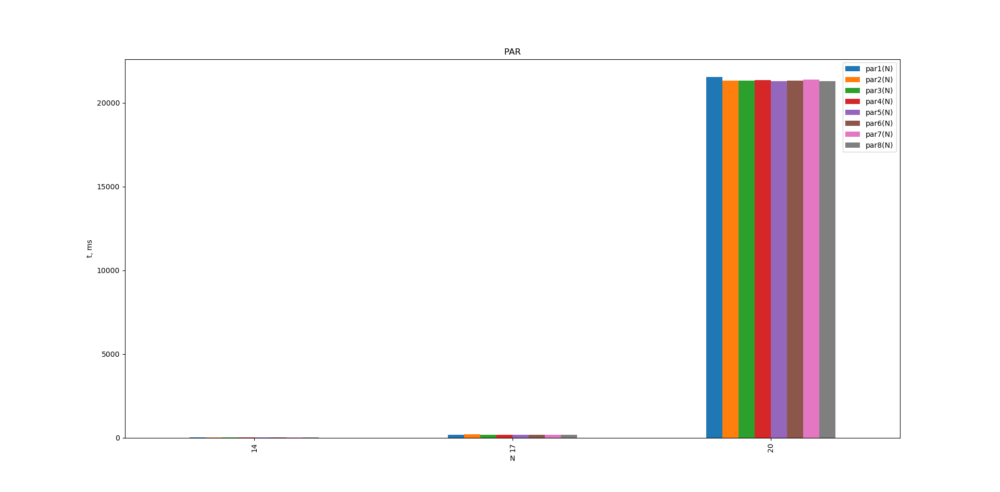
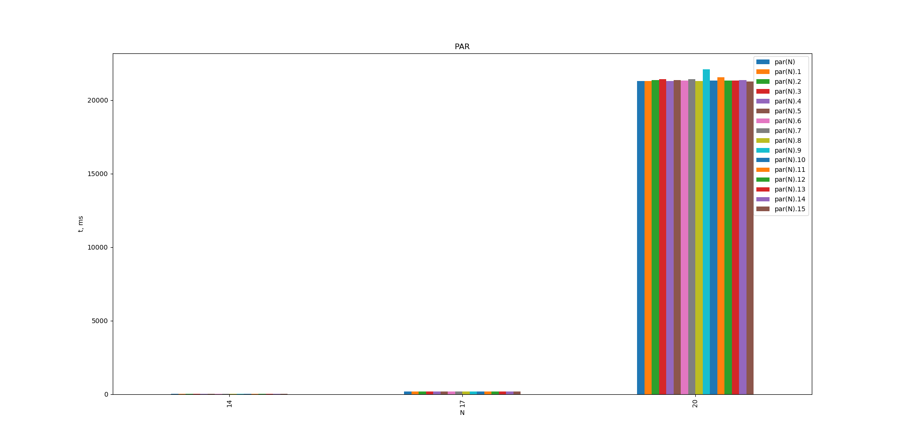
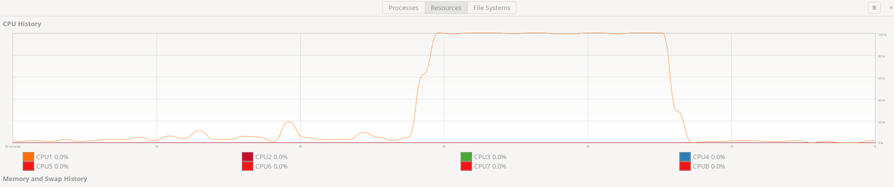
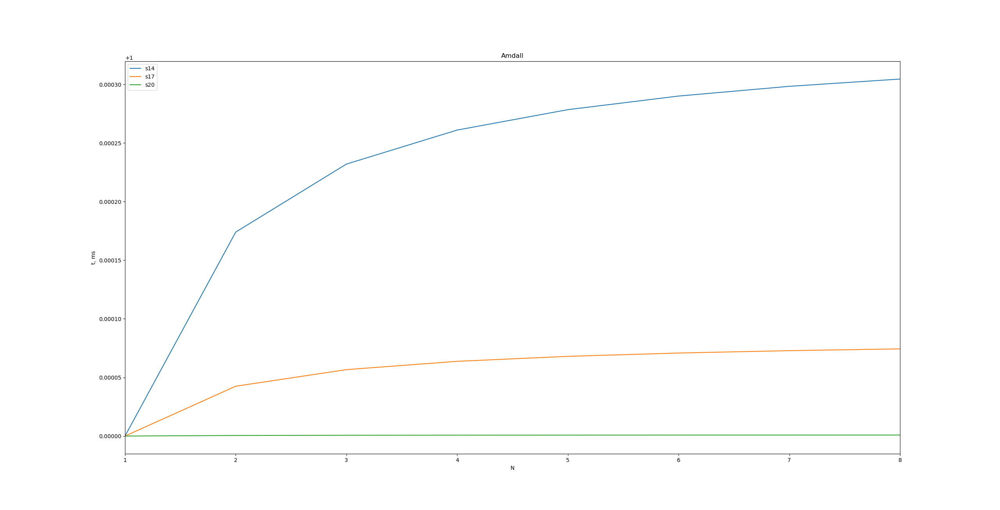

# Цель работы

В исходном коде программы, полученной в результате выполнения
лабораторной работы No1, нужно на этапах Map и Merge все циклы
с вызовами математических функций заменить их векторными ана-
логами из библиотеки «AMD Framewave» (http://framewave.
sourceforge.net). При выборе конкретной Framewave-функции
необходимо убедиться, что она помечена как MT (Multi-Threaded),
т.е. распараллеленная. Полный перечень доступных функций на-
ходится по ссылке: http://framewave.sourceforge.net/
Manual/fw_section_060.html#fw_section_060. Например,
Framewave-функция min в списке поддерживаемых технологий име-
ет только SSE2, но не MT.

# Конфигурация

## Процессор

```
CPU(s):                          16
Thread(s) per core:              1
Core(s) per socket:              8
Socket(s):                       1
NUMA node(s):                    1
Vendor ID:                       AuthenticAMD
Model name:                      AMD Ryzen 7 1700 Eight-Core Processor
CPU MHz:                         2645.861
CPU max MHz:                     3000.0000
CPU min MHz:                     1550.0000
```

RAM: 32 GB

## Компиляторы

```
gcc (GCC) 9.1.0
clang version 8.0.0
icc (ICC) 19.0.5.281 20190815
```

# Исходный код

\begin{footnotesize}
\verbatiminput{../src/main.c}
\end{footnotesize}

# Результаты

### Выполнение при $M <= K$ потоках

N   par1(N)  par2(N)  par3(N)  par4(N)  par5(N)  par6(N)  par7(N)  par8(N)
--  -------  -------  -------  -------  -------  -------  -------  ----------
14  23       22       23       23       22       23       22       21
17  177      202      175      175      193      177      174      176
20  21531    21317    21327    21361    21297    21321    21373    21291
--  -------  -------  -------  -------  -------  -------  -------  ----------


.

### Выполнение при $M > K$ потоках

N   par(N)  par(N)  par(N)  par(N)  par(N)  par(N)  par(N)  par(N)  par(N)  par(N)  par(N)  par(N)  par(N)  par(N)  par(N)  par(N)
--  ------  ------  ------  ------  ------  ------  ------  ------  ------  ------  ------  ------  ------  ------  ------  ------
14  22      23      21      23      21      22      23      22      23      23      22      24      20      22      20      22
17  177     195     177     176     176     176     176     180     196     176     177     175     200     175     176     175
20  21286   21300   21377   21413   21303   21361   21331   21431   21299   22088   21330   21561   21319   21328   21361   21280
--  ------  ------  ------  ------  ------  ------  ------  ------  ------  ------  ------  ------  ------  ------  ------  ------


.

# Загрузка процессора


.

# Расчет закона Амдала

Время выполнения программы (ms):

N  t
-- ------
14 23
17 176
20 21589
-- ------

Время выполнения распараллеленной части программы (ms):

N  t
-- ------
14 0.008
17 0.015
20 0.021
-- ------

N  k
-- --------
14 0.000348
17 0.000085
20 0.000001
-- ---------


.

# Выводы

После выполнения лабораторной работы можно сказать, что распараллеливание данной
программы не приносит существенного эффекта.
