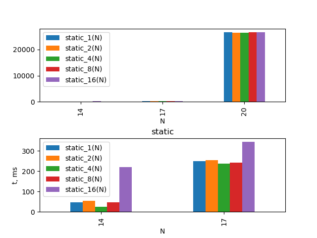
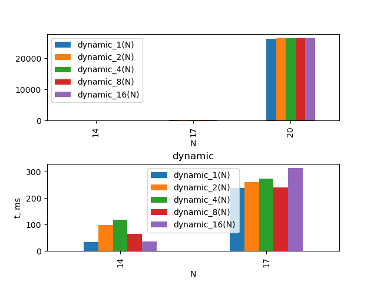
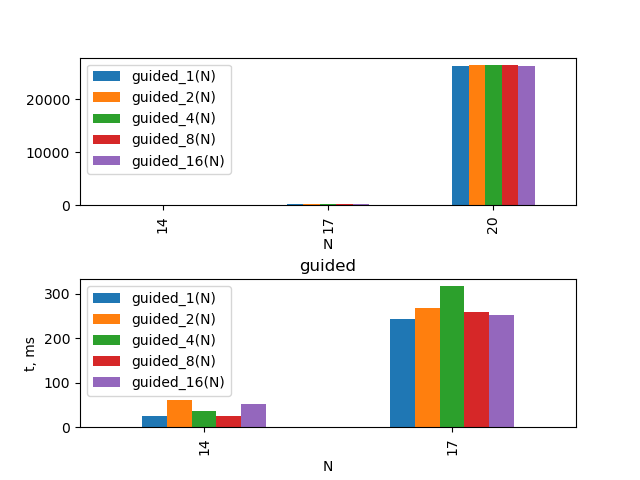
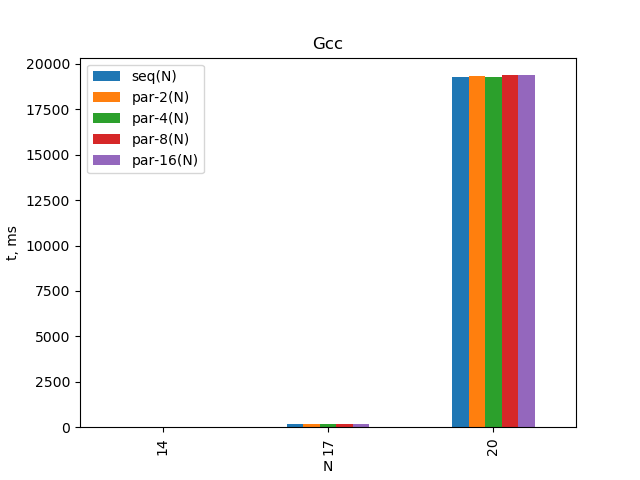
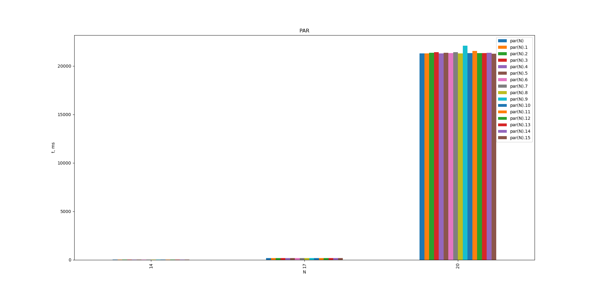
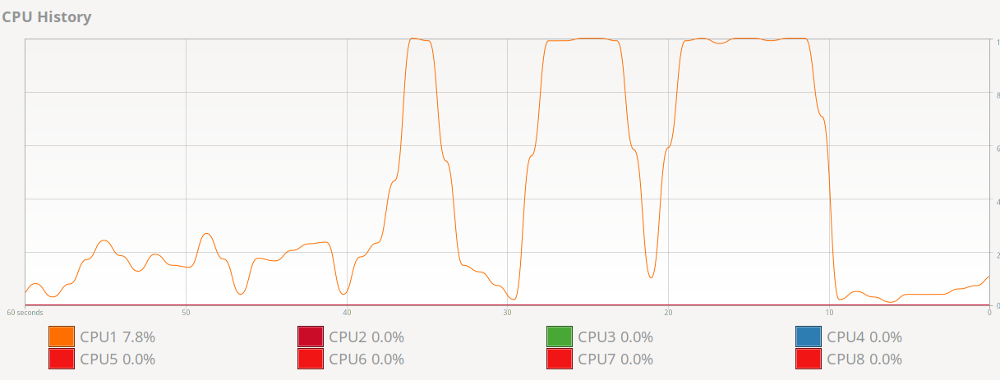
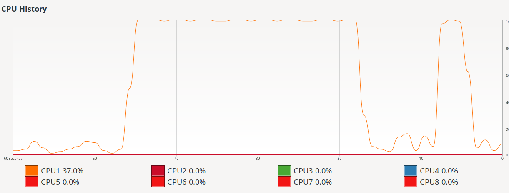
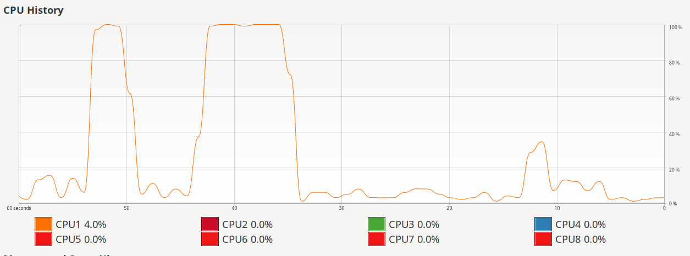
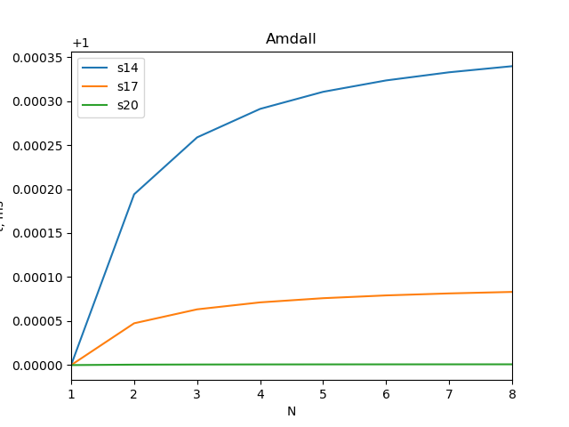

# Цель работы

Добавить во все for-циклы в программе из ЛР No1 следующую директиву OpenMP:
”#pragma omp parallel for default(none) private(...) shared(...)”. Наличие всех
перечисленных параметров в указанной директиве является обязательным.

# Конфигурация

## Процессор

```
CPU(s):                          16
Thread(s) per core:              1
Core(s) per socket:              8
Socket(s):                       1
NUMA node(s):                    1
Vendor ID:                       AuthenticAMD
Model name:                      AMD Ryzen 7 1700 Eight-Core Processor
CPU MHz:                         2645.861
CPU max MHz:                     3000.0000
CPU min MHz:                     1550.0000
```

RAM: 32 GB

## Компиляторы

```
gcc (GCC) 9.1.0
```

# Исходный код

\begin{footnotesize}
\verbatiminput{../src/main.c}
\end{footnotesize}

# Результаты


## static

N      static_1(N)      static_2(N)      static_4(N)      static_8(N)      static_16(N)
--     -----------      -----------      -----------      -----------      ------------
14     47               54               26               47               219
17     250              255              238              241              343
20     26451            26365            26391            26571            26603
--     -----------      -----------      -----------      -----------      ------------


.

## dynamic

N    dynamic_1(N)  dynamic_2(N)      dynamic_4(N)     dynamic_8(N)     dynamic_16(N)
--   ------------  ------------      ------------     ------------     -------------
14   34            99                119              65               36
17   238           261               274              241              313
20   26409         26536             26579            26445            26489
--   ------------  ------------      ------------     ------------     -------------


.

## guided

N     guided_1(N)     guided_2(N)     guided_4(N)     guided_8(N)     guided_16(N)
--    -----------     -----------     -----------     -----------     ------------
14     25             61              37              26              51
17     243            267             316             258             251
20     26373          26571           26493           26486           26390
--    -----------     -----------     -----------     -----------     ------------


.

## Предыдущие ЛР


.


.

## Загрузка процессоров


.


.


.

# График распараллеливания

N  t
-- ------
14 0.007
17 0.013
20 0.024
-- ------

N  k
-- --------
14 0.000348
17 0.000085
20 0.000001
-- ---------



# Выводы

После выполнения лабораторной работы можно сказать, что распараллеливание данной
программы не приносит существенного эффекта.
