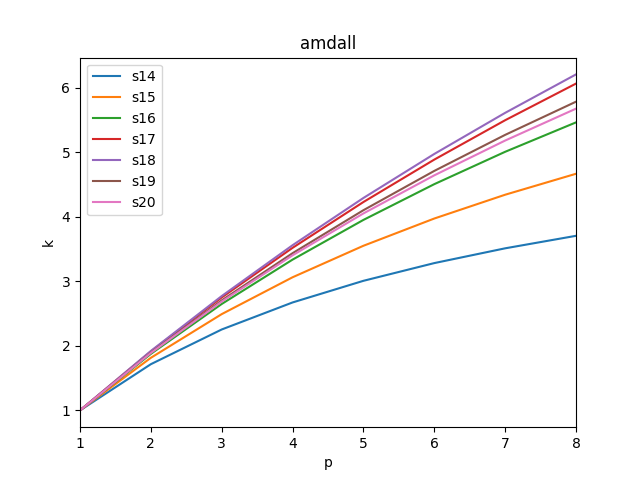
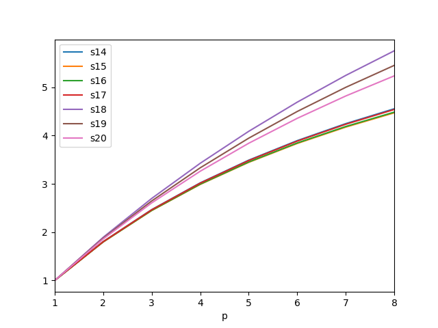
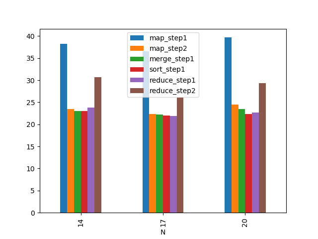

# Цель работы

Взять в качестве исходной OpenMP-программу из ЛР-5, в кото-
рой распараллелены все этапы вычисления. Убедиться, что в этой
программе корректно реализован одновременный доступ к общей
переменной, используемой для вывода в консоль процента завершения программы.

Изменить исходную программу так, чтобы вместо OpenMP-директив
применялся стандарт «POSIX Threads»

# Конфигурация

## Процессор

```
CPU(s):                          16
Thread(s) per core:              1
Core(s) per socket:              8
Socket(s):                       1
NUMA node(s):                    1
Vendor ID:                       AuthenticAMD
Model name:                      AMD Ryzen 7 1700 Eight-Core Processor
CPU MHz:                         2645.861
CPU max MHz:                     3000.0000
CPU min MHz:                     1550.0000
```

RAM: 32 GB

## Компиляторы

```
gcc (GCC) 9.1.0
```

# Исходный код

\begin{footnotesize}
\verbatiminput{../src/main.c}
\end{footnotesize}

# Результаты

## OpenMP

N       seq(N)   p(N)
--      ------   ---------
14      25       18.364857
15      30       19.751233
16      177      17.995902
17      177      27.695776
18      2401     22.627936
19      2393     20.316079
20      21513    21.677666
--      ------   ---------

Время работы параллельных участков:

N   p(N)
--  ---------
14  15.322097
15  17.734203
16  16.800604
17  26.430789
18  21.692247
19  19.202428
20  20.407868
--  ---------

N   k
--  ---------
14  0.834316
15  0.897878
16  0.933579
17  0.954325
18  0.958648
19  0.945183
20  0.941423
--  ---------


.

## pthreads

N       seq(N)   p(N)
--      ------   ---------
14      25       149.51189
15      30       158.00416
16      177      160.36467
17      177      159.20362
18      2401     159.13963
19      2393     165.20000
20      21513    159.75579
--      ------   ---------

Время работы параллельных участков:

N   p(N)
--  ---------
14  148.32282
15  156.00416
16  158.46567
17  157.80382
18  158.23863
19  164.10320
20  158.90577
--  ---------

N   k
--  ---------
14  0.8920469
15  0.8873421
16  0.8881582
17  0.8912074
18  0.9443383
19  0.9333607
20  0.9246792
--  ---------


.


.

# Выводы

После выполнения лабораторной работы можно сказать, что распараллеливание
сортировки сильно ускорило работу программы.
