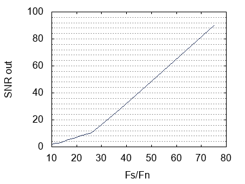
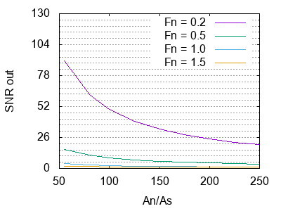
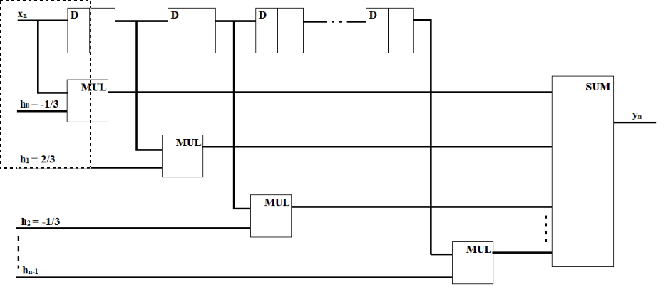

# Цель работы

Цель работы: исследование эффективности метода подавления низкочастотных помех
с помощью усредняющего фильтра.

# Задача

Пусть на входе системы наблюдается смесь полезного высокочастотного
сигнала и низкочастотной помехи. При этом на входе помеха по своей
амплитуде в несколько сот раз превышает амплитуду сигнала. Путем линейнойй
фильтрации с использованием двух видов нерекурсивного фильтра удается
увеличить соотношение сигнал/шум.

### Порядок выполнения работы

* Моделирование метода подавления низкочастотных помех при разных
соотношениях частот и амплитуд сигнала и помех;

* Определение зависимостей между этими параметрами и отношением
выходного сигнала к шуму;

* Анализ полученных результатов; составление выводов по работе.

### Вариант

Частота сигнала
: 15

Амплитуда сигнала
: 2

Частота помехи
: 0,2-1,5

Амплитуда помехи
: 110

# Ход работы

$F_n$ $\frac{F_s}{F_n}$ $SNR_{out}$
----- ----------------- -----------
0.2	  75	            90.1299
0.3	  50	            48.5
0.4	  37.5	            27.982
0.5	  30	            16.16
0.6	  26	            10.5636
0.7	  21.4286	        7.9639
0.8	  18.75	            6.5036
0.9	  16.6666	        5.249
1.0	  15    	        4.107
1.1	  13.6363	        3.3137
1.2	  12.5    	        2.853
1.3	  11.5384	        2.5611
1.4	  10.7142	        2.283
1.5	  10    	        1.9939
----- ----------------- -----------

Чем больше отношение между частотами сигнала и помехи, тем эффективнее
усредняющий фильтр. По графику можно предположить, что зависимость SNR от этого
отношения имеет линейный характер.

$F_n$ $A_n$ $\frac{A_n}{A_s}$ $SNR_{out}$ $F_n$ $A_n$ $\frac{A_n}{A_s}$ $SNR_{out}$
----- ----- ----------------- ----------- ----- ----- ----------------- -----------
0.2   110	  55	            90.13     0.5   10	  55	            16.1602
      160	  80	            61.965          60	  80	            11.1305
      200	  100	            49.543          00	  100	            8.9212
      250	  125	            39.6603         50	  125	            7.1575
      300	  150	            33.0523         00	  150	            5.985
      350	  175	            28.333          50	  175	            5.1505
      400	  200	            24.7939         00	  200	            4.527
      450	  225	            22.0417         50	  225	            4.0443
      500	  250	            19.8403         00	  250	            3.66
----- ----- ----------------- ----------- ----- ----- ----------------- -----------

$F_n$ $A_n$ $\frac{A_n}{A_s}$ $SNR_{out}$ $F_n$ $A_n$ $\frac{A_n}{A_s}$ $SNR_{out}$
----- ----- ----------------- ----------- ----- ----- ----------------- -----------
0.5   10	  55	            16.1602   1.0   10	  55	            4.107
      60	  80	            11.1305         60	  80	            2.8865
      00	  100	            8.9212          00	  100	            2.3622
      50	  125	            7.1575          50	  125	            1.9542
      00	  150	            5.985           00	  150	            1.6914
      50	  175	            5.1505          50	  175	            1.5104
      00	  200	            4.527           00	  200	            1.3796
      50	  225	            4.0443          50	  225	            1.2816
      00	  250	            3.66            00	  250	            1.2059
----- ----- ----------------- ----------- ----- ----- ----------------- -----------

$F_n$ $A_n$ $\frac{A_n}{A_s}$ $SNR_{out}$
----- ----- ----------------- -----------
1.5   10	  55	            1.9939
      60	  80	            1.5027
      00	  100	            1.302
      50	  125	            1.152
      00	  150	            1.0589
      50	  175	            0.9963
      00	  200	            0.9519
      50	  225	            0.9188
      00	  250	            0.8934
----- ----- ----------------- -----------

Чем больше отношение между амплитудами помехи и сигнала, тем менее эффективен
усредняющий фильтр.

\subsection{Функциональная схема устройства}

# Вывод

В ходе выполнения данной лабораторной работы было определено, что усредняющий
фильтр рекомендуется использовать в случаях, когда сигнал имеет
значительно большую частоту, чем помехи.
