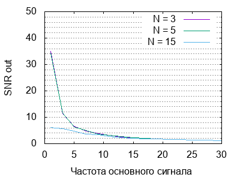
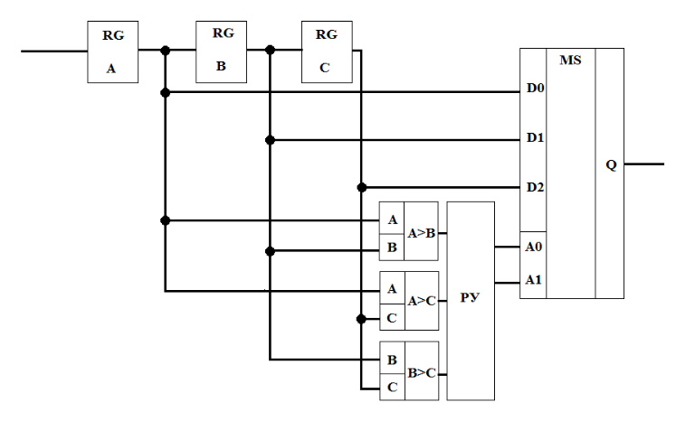

# Цель работы

Цель работы: определение возможностей применения медианного фильтра для
подавления импульсных помех.

# Этапы работы:

* Моделирование медианного фильтра при разном окне сканирования,
  частоте полезного сигнала и количестве импульсных помех;

* Определение зависимостей между этими параметрами и отношением
  выходного сигнала к шуму;

* Анализ полученных результатов; составление выводов по работе.

### Вариант

Частота сигнала
: 3

Амплитуда сигнала
: 3

Число импульсных помех
: 10 - 30

Амплитуда помехи
: 5

# Ход работы

S  N	SNR     S  N	SNR
-- --   ------- -- --   -------
3  10	4.0717  5  10	5.4428
   12	11.0915    12	5.4142
   14	3.8119     14	5.3932
   16	4.0454     16	5.607
   18	3.2844     18	5.4358
   20	2.3945     20	5.405
   22	2.5548     22	5.3653
   24	2.088      24	5.1562
   26	2.496      26	3.2979
   28	1.835      28	2.0242
   30	2.6139     30	5.2821
-- --   ------- -- --   -------

S  N 	SNR     S  N 	SNR
-- --   ------- -- --   -------
7  10	2.404   9  10	2.9498
   12	3.8974     12	2.9178
   14	3.7337     14	2.7156
   16	3.502      16	2.8836
   18	3.5427     18	2.8159
   20	3.1373     20	2.8787
   22	3.8943     22	2.7742
   24	3.6673     24	2.6828
   26	3.5126     26	2.8595
   28	3.5269     28	2.7496
   30	2.9853     30	2.8403
-- --   ------- -- --   -------

S  N	SNR
-- --   -------
11 10	2.2707
   12	2.226
   14	2.2105
   16	2.2106
   18	2.2085
   20	2.1828
   22	2.1232
   24	2.2223
   26	2.1964
   28	2.0773
   30	2.2348
-- --   -------

Большие окна дают меньший SNR при малом числе помех, но более устойчивы при
большем числе помех.

N	SNR
--  ------
10	3.1088
12	3.1683
14	2.5975
16	2.2385
18	2.572
20	2.5825
22	2.2057
24	2.273
26	2.1256
28	2.1704
30	1.8713
--  ------

Мы наблюдаем, что линейный усредняющий фильтр даёт худший результат, чем
медианный с таким же размером окна, при малом числе помех.

N  Fs	SNR     N  Fs	SNR
-- ---- ------- -- ---- -------
3  1	35.109  5  1	34.4139
   3	11.3105    3	11.5016
   5	6.62827    5	6.3442
   7	4.8507     7	4.9287
   9	3.7906     9	3.6536
   11	3.1732     11	3.0822
   13	2.5735     13	2.6214
   15	2.3333     15	2.3251
   17	2.0826     17	2.0225
   19	1.8217     19	1.8107
   21	1.696      21	1.6674
   23	1.5219     23	1.5154
   25	1.4371     25	1.3789
   27	1.2765     27	1.3118
   30	1.1897     30	1.1895
-- ---- ------- -- ---- -------

N  Fs	SNR
-- ---- -------
15 1	6.1363
   3	5.619
   5	4.7467
   7	3.65
   9	3.3393
   11	2.7751
   13	2.3529
   15	2.138
   17	1.8236
   19	1.73692
   21	1.6383
   23	1.5065
   25	1.2663
   27	1.3004
   30	1.153
-- ---- -------

При увеличении частоты сигнала способность рассматривать импульсные всплески
как помехи теряется в силу того, что сам сигнал тоже обретает импульсный
характер.

\subsection{Функциональная схема устройства}

# Вывод

При большем числе помех следует выбирать большее окно для медианного фильтра.
При малом числе помех медианный фильтр работает эффективнее, чем линейный
усредняющий. При увеличении частоты сигнала эффективность фильтра теряется.
